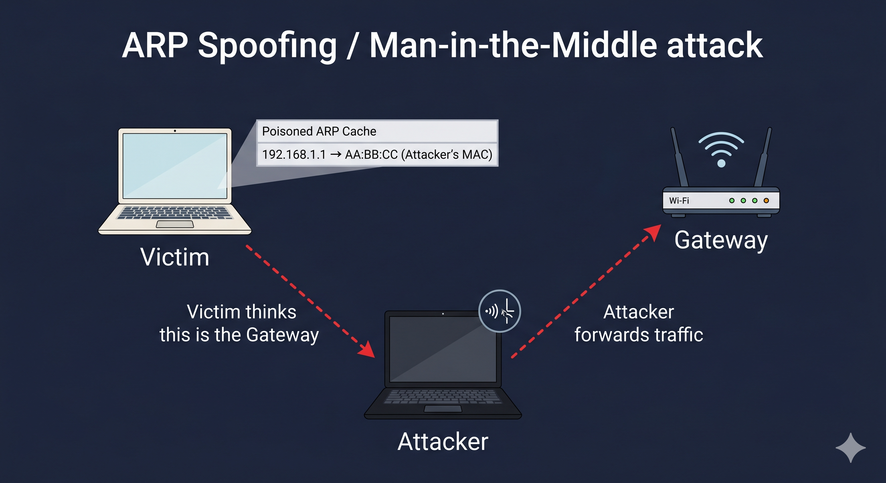

# Day 01 - ARP Spoofing

## What It Is
ARP Spoofing (also called ARP Poisoning) is a network attack where someone sends fake ARP replies to tie their MAC address to a legitimate IP on the local network. Other devices on the LAN get tricked into sending traffic to the attacker instead of the real destination.

## How It Works
ARP maps IP addresses to MAC addresses on a local network. The catch is ARP has zero authentication - your machine will accept an ARP reply even if it never asked for one.


So the attack goes like this:
1. Your machine wants to reach the router at 192.168.1.1, so it broadcasts "who has this IP?"
2. The attacker sends a fake reply saying "that's me, here's my MAC"
3. Your ARP cache gets updated with the attacker's MAC for the router's IP
4. All your traffic now goes to the attacker's machine first

From there the attacker can silently forward it (MITM) or just drop it (DoS).

## Real-World Example
Say you're on a coffee shop Wi-Fi. An attacker on the same network runs an ARP spoof between your laptop and the router. Your machine now thinks the attacker's laptop is the gateway. Every HTTP request, login form, session cookie - it all passes through their machine before hitting the internet. They can read or modify it, and you'd never know.

## Why It Matters
From an attacker's side, ARP spoofing is a stepping stone - it opens the door to credential theft, session hijacking, and SSL stripping. Works on any unsegmented LAN and tools like arpspoof or Bettercap make it trivial to run.

From a defender's side, it's tough to catch passively. The main defenses are Dynamic ARP Inspection (DAI) on managed switches, static ARP entries for critical hosts, and watching for duplicate MAC-to-IP mappings on the network.

## Key Terms
- ARP (Address Resolution Protocol): resolves IP addresses to MAC addresses on a LAN
- ARP Cache: the local table your device keeps of IP-to-MAC mappings
- ARP Poisoning: corrupting that cache with fake entries
- MITM (Man-in-the-Middle): attacker sits between two parties and intercepts their communication
- DAI (Dynamic ARP Inspection): switch feature that validates ARP packets against a DHCP snooping table

## One Tip / Tool

Tool: `arpspoof` from the dsniff suite

```bash
# allow your machine to forward packets so traffic still flows
echo 1 > /proc/sys/net/ipv4/ip_forward

# run both directions to intercept traffic between victim and gateway
arpspoof -i eth0 -t <victim_IP> <gateway_IP>
arpspoof -i eth0 -t <gateway_IP> <victim_IP>
```

Only run this on networks you own or have permission to test on.

Detection tip: run `arp -a` and check if two different IPs are mapped to the same MAC address - that's a red flag for ARP poisoning.
