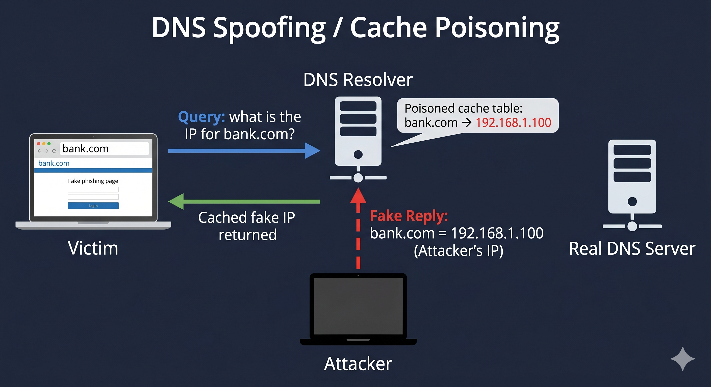

# Day 02 - DNS Spoofing

## What It Is
DNS Spoofing (also called DNS Cache Poisoning) is an attack where fake DNS records are injected into a resolver's cache, redirecting users to a malicious IP instead of the real one. The victim types a legitimate URL, but ends up on the attacker's server without any visible warning.

## How It Works
DNS translates domain names to IP addresses. When you type google.com, your machine asks a DNS resolver "what's the IP for this?" and trusts whatever it gets back.


The attack flow:
1. Your machine sends a DNS query for example.com to a resolver
2. The attacker intercepts or races to respond before the real DNS server does
3. The fake response says example.com resolves to the attacker's IP
4. That response gets cached by the resolver
5. Now everyone using that resolver gets sent to the wrong IP - until the cache expires

The key weakness here is that DNS was designed with no authentication. Older resolvers didn't verify if the response actually came from a legitimate nameserver.

## Real-World Example
An attacker poisons the DNS cache of a local network's resolver. When anyone on that network tries to visit their bank's website, they get silently redirected to a fake lookalike page hosted by the attacker. The URL in the browser still shows the correct domain. Credentials entered on that page go straight to the attacker.

Combined with ARP Spoofing (day 01), this becomes even more powerful - ARP spoofing puts the attacker in the middle, then DNS spoofing redirects the victim to a phishing site.

## Why It Matters
From an attacker's side, DNS spoofing is devastating because the victim has no obvious sign anything is wrong - the URL looks correct. It's used for phishing, credential harvesting, and malware delivery at scale.

From a defender's side, DNSSEC (DNS Security Extensions) was built to fix this by digitally signing DNS records. But adoption is still low. Other mitigations include using encrypted DNS (DNS over HTTPS or DNS over TLS) and monitoring for unexpected changes in DNS responses.

## Key Terms
- DNS (Domain Name System): the internet's phone book - maps domain names to IP addresses
- DNS Resolver: the server your machine queries to resolve domain names (often your ISP or router)
- DNS Cache: stores recent DNS responses locally to speed up future lookups
- Cache Poisoning: injecting a fake DNS record into a resolver's cache
- DNSSEC: adds cryptographic signatures to DNS records so resolvers can verify authenticity

## One Tip / Tool

Tool: `dnsspoof` from the dsniff suite (same toolkit as arpspoof)

```bash
# first run ARP spoofing to intercept traffic (see day 01)
# then spoof DNS responses for targets going through your machine
dnsspoof -i eth0 -f hosts.txt

# hosts.txt format - maps domains to your fake IP
192.168.1.100   *.google.com
192.168.1.100   *.facebook.com
```

Only use on networks you own or have explicit permission to test on.

Detection tip: run `nslookup example.com` from multiple machines or use a trusted external DNS like 8.8.8.8 directly. If results differ from what they should be, your cache may be poisoned. Tools like `dnstracer` can help trace where a response is actually coming from.


