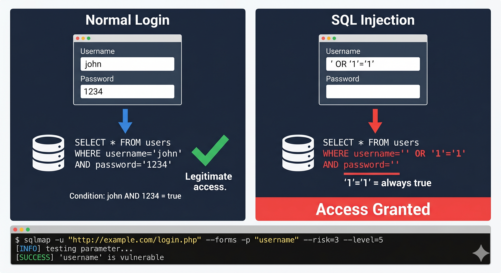

# Day 04 - SQL Injection

## What It Is
SQL Injection is a web attack where malicious SQL code is inserted into an input field to manipulate the database query running behind the scenes. Instead of the app processing your input as data, it gets executed as a database command. It's one of the most common and damaging vulnerabilities in web applications.

## How It Works
Web apps take user input and use it to build database queries. The problem is when that input isn't properly sanitized, an attacker can break out of the intended query and inject their own SQL logic.

Classic example - a login form:
```sql
-- Normal query the app builds
SELECT * FROM users WHERE username='john' AND password='1234';

-- Attacker enters:  ' OR '1'='1  in the username field
SELECT * FROM users WHERE username='' OR '1'='1' AND password='';
```

Since `'1'='1'` is always true, the query returns all users and the attacker gets in without a valid password. From here depending on the database and permissions the attacker can read tables, dump credentials, modify data, or even execute OS commands.

There are three main types:
- In-band SQLi: results come back directly in the app response
- Blind SQLi: no visible output, attacker infers data from true/false responses
- Out-of-band SQLi: data is sent to an external server the attacker controls

 


## Real-World Example
In 2008, Heartland Payment Systems got breached via SQL Injection. Attackers injected malicious SQL through a web form, moved through the network, and eventually stole over 130 million credit card numbers. It was one of the largest data breaches at the time and cost the company over $140 million in settlements.

On a smaller scale - any login page, search box, or URL parameter that isn't sanitized is a potential entry point. Something as simple as adding a `'` to a URL and seeing a database error tells an attacker the app is vulnerable.

## Why It Matters
From an attacker's side, SQLi can go from a simple login bypass all the way to full database dump, file read/write on the server, or even remote code execution depending on the database configuration. Tools like sqlmap make it easy to automate the entire attack.

From a defender's side, the fix is straightforward in principle - use parameterized queries (prepared statements) and never concatenate raw user input into SQL strings. Input validation and WAFs (Web Application Firewalls) add extra layers but prepared statements are the real fix.

## Key Terms
- SQL Injection: inserting malicious SQL into user input fields to manipulate database queries
- Parameterized Queries: a coding practice where user input is passed separately from the SQL command, preventing injection
- In-band SQLi: attacker sees results directly in the app (most common)
- Blind SQLi: no direct output, attacker guesses data through true/false responses
- WAF (Web Application Firewall): sits in front of a web app and filters malicious requests

## One Tip / Tool

Tool: `sqlmap` - automated SQL injection detection and exploitation tool

```bash
# test a URL parameter for SQLi
sqlmap -u "http://target.com/page?id=1"

# dump the entire database
sqlmap -u "http://target.com/page?id=1" --dbs

# dump a specific table
sqlmap -u "http://target.com/page?id=1" -D database_name -T users --dump
```

Only run against targets you own or have written permission to test.

Detection tip: add a single quote `'` to any input field or URL parameter. If the app throws a database error like `SQL syntax error` or behaves unexpectedly, it's likely vulnerable to SQLi.
