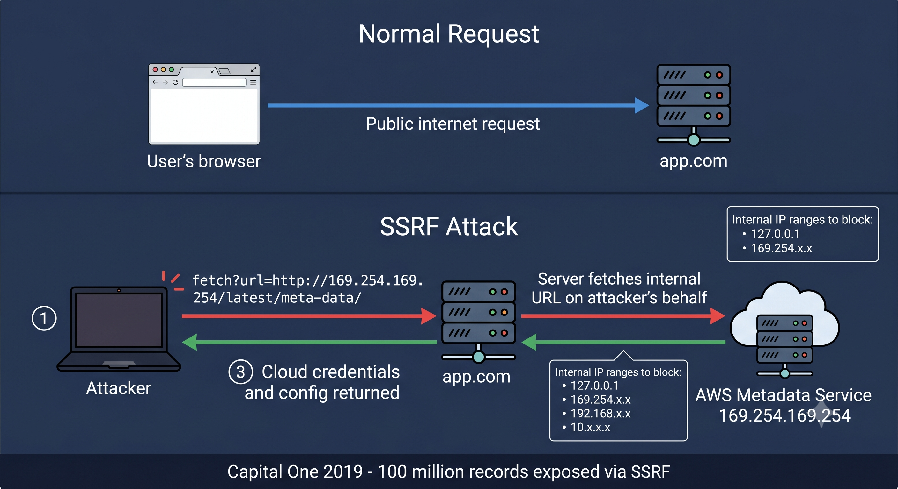

# Day 07 - SSRF (Server-Side Request Forgery)

## What It Is
SSRF is a web attack where an attacker tricks a server into making HTTP requests to an unintended location — either internal network resources or external systems. Instead of the attacker's browser making the request directly, the vulnerable server makes it on their behalf. This lets attackers reach internal systems that are normally completely hidden from the outside world.

## How It Works
Many web apps fetch remote resources based on user input — things like URL previews, image fetchers, PDF generators, or webhook validators. If the app doesn't validate what URLs it's allowed to fetch, an attacker can point it at internal infrastructure instead.



Simple example - an image fetcher feature:
```
# Normal usage
https://app.com/fetch?url=https://example.com/image.jpg

# SSRF attack - attacker points it at internal metadata service
https://app.com/fetch?url=http://169.254.169.254/latest/meta-data/

# Or internal services not exposed to the internet
https://app.com/fetch?url=http://localhost:8080/admin
https://app.com/fetch?url=http://192.168.1.1/internal-api
```

The server fetches the URL and returns the response. From the server's perspective it's just making an internal request — totally allowed. The attacker now gets data from internal systems they should never have access to.

## Real-World Example
The 2019 Capital One breach was triggered by an SSRF vulnerability. The attacker found an SSRF flaw in Capital One's web application running on AWS. They used it to query the AWS instance metadata endpoint at `169.254.169.254` — a special internal IP that returns cloud credentials and configuration for the running instance. With those credentials they accessed S3 buckets and exfiltrated data from over 100 million customer records. The attacker was eventually caught but the damage was done.

## Why It Matters
From an attacker's side, SSRF is especially dangerous in cloud environments because internal metadata services hand out temporary credentials and configuration details. An attacker with SSRF can pivot from a simple web vulnerability to full cloud account takeover. It can also be used to port scan internal networks, access admin panels, or hit internal APIs that assume all traffic is trusted.

From a defender's side, the fix is strict allowlisting of URLs the server is permitted to fetch — block all internal IP ranges (localhost, 169.254.x.x, 10.x.x.x, 192.168.x.x) and only allow specific external domains. Cloud providers like AWS now have IMDSv2 which requires a session token to access metadata, making basic SSRF harder to exploit against the metadata service.

## Key Terms
- SSRF (Server-Side Request Forgery): attacker manipulates a server into making requests to unintended internal or external resources
- Internal Metadata Service: a special endpoint (169.254.169.254) in cloud environments that returns credentials and config for the running instance
- Allowlist: a list of explicitly permitted URLs or IP ranges a server is allowed to contact
- IMDSv2: AWS's improved instance metadata service that requires session-based authentication, mitigating basic SSRF attacks
- Blind SSRF: the server makes the request but doesn't return the response to the attacker — harder to exploit but still dangerous

## One Tip / Tool

Tool: `SSRFmap` — automated SSRF detection and exploitation

```bash
# clone SSRFmap
git clone https://github.com/swisskyrepo/SSRFmap
cd SSRFmap
pip install -r requirements.txt

# test a request file for SSRF
python ssrfmap.py -r request.txt -p url -m readfiles

# request.txt contains the intercepted HTTP request with the vulnerable parameter
```

Quick manual test - find any parameter that accepts a URL (webhooks, image URLs, document fetchers). Try replacing it with:
```
http://127.0.0.1
http://169.254.169.254/latest/meta-data/
http://localhost:8080
```
If the server returns internal data or behaves differently, it's vulnerable to SSRF.
