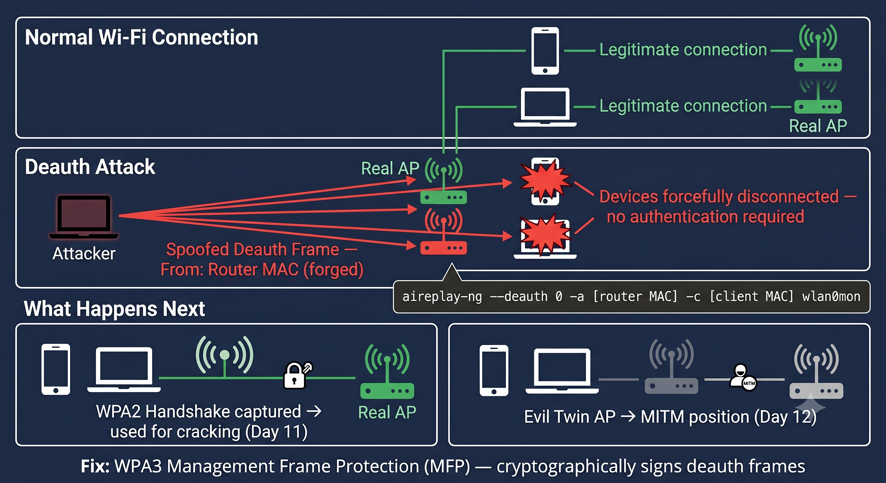

# Day 13 - Deauth Attack

## What It Is
A Deauth (Deauthentication) Attack is a wireless attack where the attacker sends forged deauthentication frames to a client device, a router, or an entire network — forcefully disconnecting devices from their Wi-Fi. It exploits a fundamental flaw in the 802.11 Wi-Fi standard where deauth frames are unauthenticated, meaning anyone can send them and they will be obeyed without question.

## How It Works
In the 802.11 Wi-Fi standard, deauthentication frames are management frames used by routers to disconnect clients. The problem is these frames have no authentication or encryption — any device in range can forge one. The victim's device receives the forged frame, thinks the router asked it to disconnect, and drops the connection immediately.



Attack flow:
1. Attacker puts wireless adapter into monitor mode
2. Scans for target network and identifies the router MAC and client MAC
3. Sends forged deauth frames spoofing the router's MAC address
4. Victim device disconnects thinking the router requested it
5. Victim device tries to reconnect — triggering a new WPA2 handshake
6. Attacker captures that handshake for offline cracking (day 11)
7. Or victim connects to an Evil Twin AP instead (day 12)

```bash
# enable monitor mode
airmon-ng start wlan0

# scan to find target — note BSSID (router MAC) and client MAC
airodump-ng wlan0mon

# send deauth packets to a specific client
aireplay-ng --deauth 100 -a [router MAC] -c [client MAC] wlan0mon

# send deauth to entire network (broadcast)
aireplay-ng --deauth 100 -a [router MAC] wlan0mon
```

The `100` is the number of deauth frames to send. Sending continuously keeps the victim permanently disconnected.

## Real-World Example
Deauth attacks are used in two main scenarios in real pentesting. First as a helper attack — when doing WPA2 cracking (day 11) and no device is connecting to capture a handshake naturally, a quick deauth forces a reconnection and captures the handshake in seconds instead of waiting around. Second as a standalone DoS — a disgruntled person at a café can run a continuous deauth attack and knock everyone off the Wi-Fi indefinitely, and there's nothing the router can do about it.

In 2014, researchers demonstrated deauth attacks against aircraft Wi-Fi systems at security conferences, showing how in-flight Wi-Fi could be disrupted using nothing but a laptop and a wireless adapter.

## Why It Matters
From an attacker's side, deauth is the perfect enabler attack — it forces handshake captures for WPA2 cracking, drives victims onto Evil Twin APs, and can be used as a pure denial of service with zero authentication required. It's trivially easy to execute and nearly impossible to stop on WPA2 networks.

From a defender's side, WPA3 finally addresses this with Management Frame Protection (MFP) which cryptographically authenticates management frames including deauth, making forged frames invalid. On WPA2 networks, 802.11w (Protected Management Frames) provides partial protection. Enterprise networks can use wireless intrusion detection systems (WIDS) to detect and alert on deauth floods.

## Key Terms
- Deauthentication Frame: a management frame in the 802.11 standard used to disconnect a client from an AP
- 802.11: the family of Wi-Fi standards (802.11a/b/g/n/ac/ax) that define how wireless networks operate
- Management Frame: control frames used for Wi-Fi connection management — association, authentication, deauthentication
- MFP (Management Frame Protection): WPA3 feature that cryptographically signs management frames to prevent forgery
- DoS (Denial of Service): attack that disrupts availability of a service — deauth is a wireless DoS

## One Tip / Tool

Tool: `aireplay-ng` for deauth attacks and `mdk4` for more aggressive wireless disruption

```bash
# targeted deauth — kick one specific client
aireplay-ng --deauth 0 -a [router MAC] -c [client MAC] wlan0mon

# the 0 means send continuously until stopped with Ctrl+C

# using mdk4 for broadcast deauth across all channels
mdk4 wlan0mon d -B [router MAC]
```

A great tool for visualizing what's happening during a deauth attack is `airodump-ng` running in parallel — you can watch devices drop and reconnect in real time as the deauth frames hit.

Only use on networks you own or have explicit permission to test on. Running deauth attacks on public networks is illegal in most countries.
