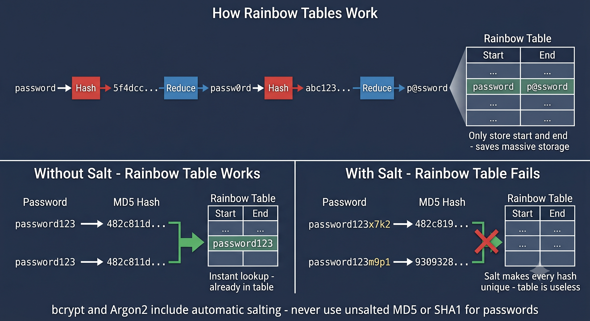

# Day 16 - Rainbow Tables

## What It Is
A Rainbow Table is a precomputed lookup table that maps password hashes back to their original plaintext values. Instead of hashing passwords on the fly during cracking (like hashcat does), rainbow tables do all the computation in advance and store the results. When you want to crack a hash you just look it up in the table — instant result. It's a time-memory tradeoff — you spend storage space to save cracking time.

## How It Works
The naive approach to precomputation would be storing every possible password and its hash — but that would require impossibly large storage. Rainbow tables solve this with chains of alternating hash and reduction functions that compress massive amounts of data into manageable table sizes.



Simple concept:
```
password → [hash] → 5f4dcc3b... → [reduce] → passw0rd → [hash] → abc123... → [reduce] → p@ssword
```

Each chain starts from a random password, alternates between hashing and reducing, and stores only the start and end points. To crack a hash you run it through the same chain process and look up the endpoint in the table.

The key weakness rainbow tables exploit:
```
# Without salt - same password always produces same hash
"password123" → MD5 → 482c811da5d5b4bc6d497ffa98491e38
"password123" → MD5 → 482c811da5d5b4bc6d497ffa98491e38  ← identical, lookup works

# With salt - same password produces different hash every time
"password123" + "x7k2" → MD5 → 9b8e2f4a1c3d6e7f...  ← unique, lookup fails
"password123" + "m9p1" → MD5 → 3a7c4b2e8f1d5a6b...  ← different salt, different hash
```
Salting completely defeats rainbow tables because you'd need a separate table for every possible salt value.

## Real-World Example
In 2007, the social networking site Gawker stored passwords using unsalted MD5 hashes. When their database was breached, attackers used rainbow tables to crack the majority of passwords within hours — not days or weeks, but hours. Passwords that would have taken a dictionary attack much longer were recovered almost instantly because they were already in precomputed tables.

The same pattern repeated in dozens of major breaches throughout the 2000s and early 2010s — RockYou (2009), Adobe (2013), and many others all used weak unsalted hashing which made rainbow table attacks trivially effective.

## Why It Matters
From an attacker's side, rainbow tables make cracking unsalted hashes nearly instant regardless of password complexity. You can download precomputed rainbow tables for MD5, SHA1, and NTLM covering billions of passwords from sites like crack.sh. No GPU required — just a lookup.

From a defender's side, a single random salt per password completely kills rainbow tables. Modern password hashing algorithms like bcrypt, scrypt, and Argon2 automatically handle salting internally — there's no reason to use unsalted MD5 or SHA1 for passwords in 2024. This is also why Windows NTLM hashes (which are unsalted) are particularly vulnerable to rainbow table attacks.

## Key Terms
- Rainbow Table: a precomputed table of password-to-hash mappings used for instant hash lookups.
- Time-Memory Tradeoff: trading storage space for computation speed — rainbow tables store results to avoid recomputing.
- Salt: a unique random value added to each password before hashing, making precomputed tables useless.
- Chain: the core structure of a rainbow table — alternating hash and reduction functions stored as start and end points.
- NTLM: Windows password hash format that uses unsalted MD4, making it highly vulnerable to rainbow table attacks.

## One Tip / Tool

Tool: `RainbowCrack` for generating and using rainbow tables, and `crack.sh` for online NTLM lookups

```bash
# generate a rainbow table for MD5 (lowercase alpha, 1-7 chars)
rtgen md5 loweralpha 1 7 0 3800 33554432 0

# sort the table (required before lookup)
rtsort *.rt

# crack hashes using the table
rcrack . -h 5f4dcc3b5aa765d61d8327deb882cf99
```

For Windows NTLM hashes specifically, **crack.sh** is a free online service with precomputed rainbow tables covering almost every NTLM hash from common passwords — paste your NTLM hash and get the result back in seconds. It's the fastest way to crack unsalted Windows hashes without any local setup.
