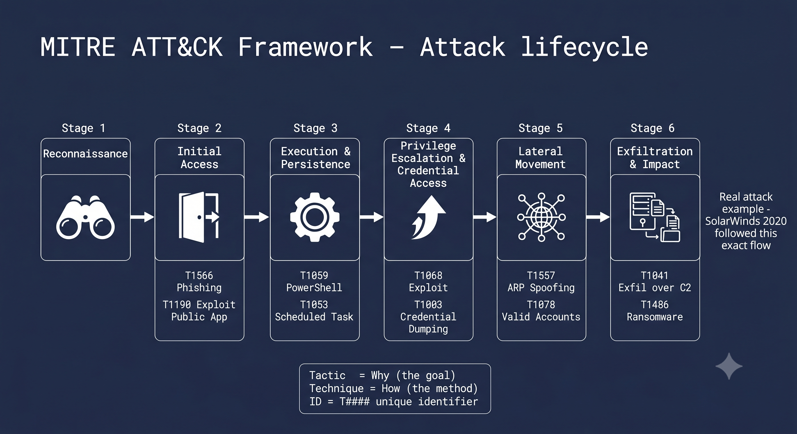

# Day 21 - MITRE ATT&CK Framework

## What It Is
MITRE ATT&CK (Adversarial Tactics, Techniques, and Common Knowledge) is a globally accessible knowledge base of real-world attacker behaviors based on observations from actual cyber attacks. It organizes how attackers operate into a structured matrix of Tactics (the why) and Techniques (the how). It's not a tool or a product — it's a framework used by defenders, red teams, and threat intelligence analysts as a common language to describe and understand attacks.

## How It Works
The ATT&CK matrix is organized into 14 Tactics that represent the different phases of an attack, each containing dozens of Techniques that describe specific methods attackers use to achieve that tactic.



The 14 Tactics in order:
```
1.  Reconnaissance          - gathering info before the attack
2.  Resource Development    - setting up infrastructure
3.  Initial Access          - getting into the target
4.  Execution               - running malicious code
5.  Persistence             - maintaining access across reboots
6.  Privilege Escalation    - gaining higher permissions
7.  Defense Evasion         - avoiding detection
8.  Credential Access       - stealing credentials
9.  Discovery               - learning about the environment
10. Lateral Movement        - moving to other systems
11. Collection              - gathering data of interest
12. Command and Control     - communicating with compromised systems
13. Exfiltration            - stealing data out of the network
14. Impact                  - disrupting or destroying systems
```

Each technique has a unique ID. For example:
- T1059 - Command and Scripting Interpreter (running PowerShell, bash)
- T1078 - Valid Accounts (using stolen credentials)
- T1003 - OS Credential Dumping (mimikatz — covered in day 17)
- T1566 - Phishing (initial access via malicious email)

## Real-World Example
When the SolarWinds attack was discovered in 2020, security teams mapped the entire attack to MITRE ATT&CK techniques. The attackers used T1195 (Supply Chain Compromise) for initial access, T1027 (Obfuscated Files) for defense evasion, and T1071 (Application Layer Protocol) for C2 communication. Having this common framework meant teams across different organizations could instantly understand and share exactly what the attackers did at each stage — accelerating response and detection across the entire industry.

## Why It Matters
From an attacker's side (red team), ATT&CK is used to plan realistic attack simulations — ensuring penetration tests cover the same techniques real threat actors use rather than just running automated scanners.

From a defender's side (blue team), ATT&CK helps prioritize defensive controls, build detection rules in SIEMs, and measure how well your security stack covers known attacker techniques. Tools like MITRE ATT&CK Navigator let you visually map your detections against the full matrix to find gaps.

## Key Terms
- Tactic: the high level goal an attacker wants to achieve (e.g. Persistence, Lateral Movement).
- Technique: the specific method used to achieve a tactic (e.g. T1053 — Scheduled Task for Persistence).
- Sub-technique: a more specific variation of a technique (e.g. T1053.005 — Scheduled Task specifically on Windows).
- ATT&CK Navigator: a web tool for visualizing and annotating the ATT&CK matrix.
- Threat Intelligence: using ATT&CK to map known threat actor groups (APTs) to their specific techniques.

## One Tip / Tool

Tool: MITRE ATT&CK Navigator — free web based tool to explore and annotate the matrix

```
# access the full ATT&CK matrix
https://attack.mitre.org

# use the Navigator to map detections
https://mitre-attack.github.io/attack-navigator

# search any technique by ID
https://attack.mitre.org/techniques/T1059/
```

A great exercise — take any attack we've covered in this repo and map it to ATT&CK:
- ARP Spoofing (day 01) → T1557 (Adversary-in-the-Middle)
- SQL Injection (day 04) → T1190 (Exploit Public-Facing Application)
- Mimikatz / Pass the Hash (day 17) → T1003 (OS Credential Dumping)
- RATs (day 20) → T1219 (Remote Access Software)

This is exactly the kind of mapping that SOC analysts and threat hunters do every day.
