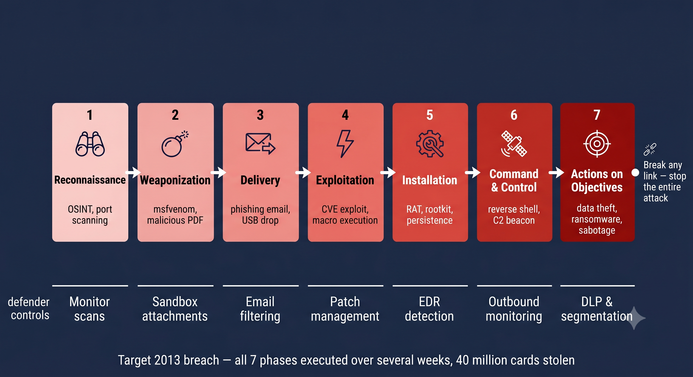

# Day 22 - Cyber Kill Chain

## What It Is
The Cyber Kill Chain is a framework developed by Lockheed Martin in 2011 that describes the seven stages of a cyber attack — from initial reconnaissance all the way to the final objective. The idea comes from military targeting models — if you can disrupt any single link in the chain, you break the entire attack. It gives defenders a structured way to detect, respond to, and prevent attacks at each stage rather than just reacting after damage is done.


## How It Works
Every sophisticated cyber attack follows a predictable sequence of steps. The Kill Chain breaks this into 7 phases:




```
Phase 1 — Reconnaissance
Attacker gathers information about the target
Tools: OSINT, Shodan, LinkedIn scraping, DNS enumeration
Example: finding employee emails for phishing, scanning for open ports

Phase 2 — Weaponization
Attacker creates a malicious payload tailored to the target
Tools: msfvenom, macro-enabled Office documents, malicious PDFs
Example: building a RAT (day 20) disguised as an invoice PDF

Phase 3 — Delivery
Attacker delivers the weapon to the target
Methods: phishing email, malicious USB, watering hole attack
Example: sending the malicious PDF to HR via a spoofed email

Phase 4 — Exploitation
The payload exploits a vulnerability to execute
Examples: user opens PDF, macro runs, buffer overflow (day 10) triggers
This is where initial code execution happens

Phase 5 — Installation
Malware installs itself and establishes persistence
Examples: RAT installs (day 20), rootkit deployed (day 18), registry key added
Goal: survive reboots and maintain access

Phase 6 — Command and Control (C2)
Malware connects back to attacker's server
Examples: reverse shell (day 09), RAT C2 channel
Attacker now has interactive control of the victim machine

Phase 7 — Actions on Objectives
Attacker achieves their final goal
Examples: data exfiltration, ransomware deployment, lateral movement, sabotage
```

## Real-World Example
The 2013 Target breach followed the Kill Chain perfectly. Attackers started with Reconnaissance — finding that Target used a third-party HVAC vendor with network access. Weaponization and Delivery — sent malware to the vendor via phishing. Exploitation and Installation — compromised the vendor's credentials and used them to access Target's network. C2 — established persistent access. Actions on Objectives — deployed point-of-sale malware that stole 40 million credit card numbers over several weeks. Defenders who had monitored earlier kill chain phases could have stopped it long before the data was stolen.


## Why It Matters
From an attacker's side, understanding the Kill Chain helps plan a complete attack and anticipate where defenders might detect you — allowing you to focus on evasion at each stage.

From a defender's side, the Kill Chain shifts the mindset from purely reactive (responding after breach) to proactive — building detection and prevention controls at every phase. Stopping an attack at Reconnaissance or Delivery is far cheaper than responding after Actions on Objectives. Each phase also leaves different indicators of compromise (IOCs) that security teams can monitor for.

## Key Terms
- Cyber Kill Chain: Lockheed Martin's 7 phase framework describing the stages of a cyber attack.
- Reconnaissance: the intelligence gathering phase before an attack begins.
- Weaponization: creating a malicious payload designed to exploit the target.
- IOC (Indicator of Compromise): evidence that an attack has occurred at a particular kill chain phase.
- Lateral Movement: moving from the initial compromised machine to other systems in the network (Kill Chain phase 7).

## One Tip / Tool

Tool: Use the Kill Chain as a detection checklist — map your security controls to each phase

```
Phase 1 Recon       → monitor for port scans, OSINT about your org
Phase 2 Weaponize   → email attachment sandboxing, AV scanning
Phase 3 Delivery    → email filtering, web proxy, phishing awareness
Phase 4 Exploit     → patch management, EDR, application whitelisting
Phase 5 Install     → EDR behavioral detection, integrity monitoring
Phase 6 C2          → outbound traffic monitoring, DNS filtering
Phase 7 Objectives  → DLP (Data Loss Prevention), network segmentation
```

A great exercise — take the Target breach or any major attack and map every attacker action to its Kill Chain phase. This is exactly what incident responders do during post-breach analysis and what threat hunters do proactively to find gaps in detection coverage.
