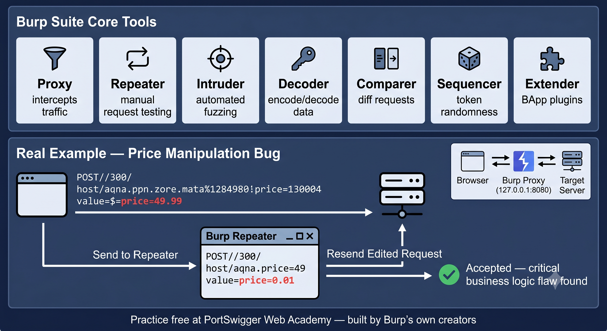

# Day 26 - Burp Suite Deep Dive

## What It Is
Burp Suite is the industry standard intercepting proxy and web application security testing platform, built by PortSwigger. It sits between your browser and the target web application, letting you intercept, inspect, and modify every HTTP request and response in real time. While we've referenced Burp Suite earlier in this repo (CSRF PoC generation on day 06), today covers the full toolset that makes it the primary tool for almost every web app pentest in the industry.

## How It Works
Burp Suite is made up of several integrated tools that work together around a core proxy:



```
Proxy        - intercepts and modifies traffic between browser and target
Repeater     - resend and manually modify individual requests repeatedly
Intruder     - automate sending many requests with varying payloads (fuzzing, brute force)
Decoder      - encode/decode data (Base64, URL encoding, hex) instantly
Comparer     - diff two requests or responses to spot subtle differences
Sequencer    - analyze randomness in session tokens for predictability
Extender     - install community plugins (BApps) to extend functionality
```
Basic workflow for testing a login form:
```
1. Configure browser to proxy through Burp (default 127.0.0.1:8080)
2. Submit a login request through the browser
3. Burp's Proxy tab intercepts the raw HTTP request before it's sent
4. Right click → "Send to Repeater" to manually test variations
5. In Repeater, modify parameters and resend instantly to observe responses
6. If testing for brute force, send the request to Intruder instead
7. In Intruder, mark the password field as a payload position
8. Load a wordlist and start the attack — Burp sends hundreds of requests automatically
9. Sort results by response length or status code to spot the successful login
```

This single workflow alone can test for SQL Injection (day 04), broken authentication (day 06 CSRF related), and brute force vulnerabilities all from the same captured request.

## Real-World Example
In professional web app pentesting, almost every finding starts in Burp's Proxy history. A pentester testing an e-commerce site notices a request containing `price=49.99` when adding an item to cart. They send it to Repeater, change the value to `price=0.01`, resend it, and the server accepts it without validation — a critical business logic flaw allowing anyone to set their own prices. This exact kind of manual testing, impossible to fully automate, is why Burp Suite remains essential even with modern automated scanners.

## Why It Matters
From an attacker's / pentester's side, Burp Suite combines manual precision (Repeater) with automation (Intruder) in one tool, covering nearly every web app attack category from this repo — SQLi, XSS, CSRF, SSRF, broken auth — all testable through the same intercepted traffic.

From a defender's side, understanding how Burp Suite works helps developers think about what an attacker can see and modify — every parameter, header, and cookie sent to your server should be treated as untrusted and validated server-side, because tools like Burp make manipulating any of it trivial.

## Key Terms
- Intercepting Proxy: a tool that sits between client and server, allowing inspection and modification of traffic in transit.
- Repeater: Burp's tool for manually resending and modifying individual HTTP requests.
- Intruder: Burp's tool for automating attacks by sending many requests with varying payloads.
- Payload Position: the specific part of a request marked for Intruder to substitute with wordlist values.
- BApp Store: Burp's extension marketplace offering community-built plugins for additional functionality.

## One Tip / Tool

Tool: Burp Suite Community Edition (free) vs Professional (paid, includes automated scanner)

```
Quick Intruder attack types:
- Sniper      - one payload set, one position at a time (most common)
- Battering Ram - same payload in all positions simultaneously
- Pitchfork   - multiple payload sets, one per position, synced together
- Cluster Bomb - multiple payload sets, every combination tested (slow but thorough)

Useful keyboard shortcut: Ctrl+R sends any request straight to Repeater from anywhere in Burp
```

The best way to practice Burp Suite hands-on is **PortSwigger Web Academy** (free, made by Burp's own creators) — every lab is designed specifically around using Burp's tools, and it's the single best resource for going from beginner to advanced with this tool. Pair it with the topics already covered in this repo — try finding SQLi (day 04), XSS (day 05), and CSRF (day 06) using only Burp Suite.
