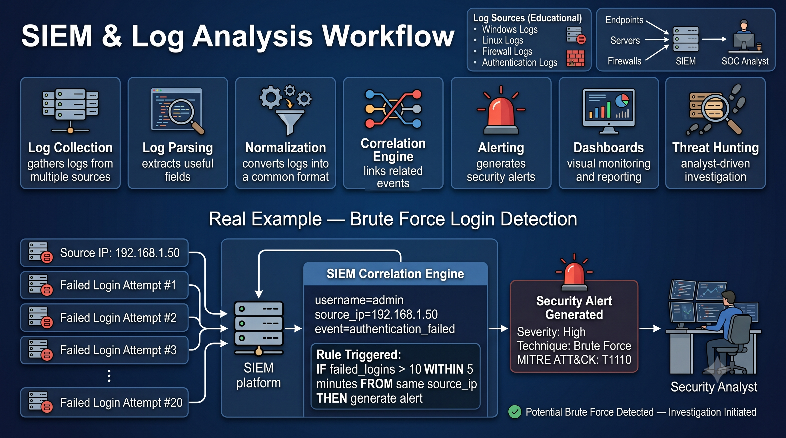

# Day 28 - SIEM & Log Analysis

## What It Is
A SIEM (Security Information and Event Management) is a platform that collects, aggregates, and analyzes log data from across an entire IT environment — servers, firewalls, endpoints, applications, cloud services — in one centralized place. Instead of a security analyst manually checking dozens of separate systems, a SIEM correlates events from everywhere and surfaces suspicious patterns that would be invisible looking at any single log source alone.

## How It Works
Every action on a network generates a log — a login, a file access, a network connection, a process execution. Individually most logs look harmless. A SIEM's value comes from correlation — connecting events across different sources to reveal an attack pattern.




```
Log Sources feeding into a SIEM:
- Firewall logs        - blocked/allowed connections
- Windows Event Logs   - logins, process creation, account changes
- Web server logs      - HTTP requests, status codes
- EDR/Antivirus logs   - malware detections, process behavior
- Cloud logs           - AWS CloudTrail, Azure Activity Logs
- Authentication logs  - VPN, Active Directory, SSO
```

Example correlation rule that would catch real attacks from this repo:
```
IF (failed login attempts > 50 from same IP within 5 minutes)   ← brute force
AND (successful login follows immediately after)                ← password cracked
AND (new process spawned: mimikatz.exe OR powershell -enc)       ← day 17 hash dumping
THEN trigger HIGH severity alert
```
A single failed login means nothing. Fifty failed logins followed by a success followed by mimikatz execution is unmistakably an attack — and only a SIEM correlating all three log sources together can catch that pattern in real time.

## Real-World Example
In many real incident investigations, attackers are caught specifically because SIEM correlation rules fired on combinations of normal-looking events. For example, an attacker using Pass the Hash (day 17) to move laterally might look completely normal in any single system's logs — just a successful login. But a SIEM correlating "same NTLM hash used to authenticate to 5 different machines within 10 minutes" flags it instantly as impossible normal user behavior, since no real employee logs into five machines simultaneously.

The 2013 Target breach (referenced on day 22) actually had its malware detected by Target's own security monitoring tools before the breach was fully realized — but the alerts were reportedly not acted upon in time, showing that even with the right detection in place, the human response process around a SIEM matters just as much as the technology.

## Why It Matters
From an attacker's side, understanding what SIEMs typically monitor helps in planning evasion — using living-off-the-land techniques (using legitimate tools like PowerShell instead of obvious malware) to blend in with normal log noise.

From a defender's side, a SIEM is only as good as its correlation rules and the analysts watching it. Modern SIEMs (Splunk, Microsoft Sentinel, Elastic SIEM) increasingly use machine learning to detect anomalies beyond fixed rules, but a poorly tuned SIEM either floods analysts with false positives (alert fatigue) or misses real attacks entirely if rules are too narrow.

## Key Terms
- SIEM (Security Information and Event Management): a platform that aggregates and correlates logs from across an environment to detect threats.
- Log Correlation: connecting events from multiple log sources to reveal patterns invisible in any single source.
- SOC (Security Operations Center): the team and facility responsible for monitoring and responding to security alerts, typically using a SIEM.
- False Positive: an alert that looks like an attack but turns out to be legitimate activity, a major challenge in SIEM tuning.
- Living off the Land: using legitimate built-in system tools (PowerShell, WMI) for malicious purposes to avoid detection.

## One Tip / Tool

Tool: `Splunk` (industry standard, commercial) and `Elastic Security` / the ELK Stack (free, open source) for learning SIEM concepts

```
Basic SPL (Splunk) query example - hunting for the pattern shown above:
index=auth_logs action=failure | stats count by src_ip 
| where count > 50
| join src_ip [search index=auth_logs action=success]
```

Free hands-on practice — **Splunk's own free training environment (Boss of the SOC)** is a fantastic resource that gives you real attack scenario logs and walks you through writing detection queries to catch them, directly applying SIEM concepts to attacks like the ones covered throughout this repo.
