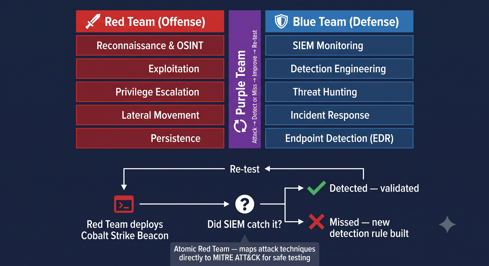

# Day 31 - Blue Team vs Red Team

## What It Is
Blue Team and Red Team are the two opposing roles in cybersecurity that work together to improve an organization's security posture. The Red Team simulates real attackers — finding and exploiting vulnerabilities the way a malicious actor would. The Blue Team is the defense — detecting, responding to, and preventing those attacks. Neither role is more important than the other; they exist specifically to test and strengthen each other in a continuous cycle.

## How It Works
The two teams approach the same systems from opposite directions:



```
Red Team (Offense)                    Blue Team (Defense)
- Reconnaissance & OSINT              - SIEM monitoring (day 28)
- Exploitation (SQLi, XSS, etc)       - Detection engineering / alert tuning
- Privilege escalation                - Threat hunting (day 29)
- Lateral movement                    - Incident response (day 30)
- Persistence (RATs, day 20)          - Endpoint detection (EDR)
- Reporting findings to the org       - Patching and hardening systems
```

A mature organization runs both simultaneously, often with a third role bridging them:

```
Purple Team - facilitates collaboration between Red and Blue
            - Red Team executes an attack technique (e.g. day 17 Pass the Hash)
            - Blue Team checks in real time whether their tools detected it
            - If missed, Blue Team builds a new detection rule
            - Red Team re-runs the same technique to validate the fix works
```

This loop — attack, detect (or miss), improve, re-test — is how security programs actually mature over time rather than just collecting a list of vulnerabilities that never get validated as fixed.

## Real-World Example
Many large organizations run continuous Red Team engagements specifically designed to test whether the Blue Team's SIEM (day 28) and detection rules catch real attack chains — not just individual exploits, but full kill chains (day 22) from initial access through to data exfiltration. A common exercise: the Red Team uses a technique covered in this repo, like deploying a Cobalt Strike Beacon (day 27) with Malleable C2 to mimic normal traffic. If the Blue Team's SOC analysts don't catch it within an agreed time window, that becomes a documented gap — leading directly to new detection rules, better log sources, or analyst training, closing the gap before a real attacker exploits it.

## Why It Matters
From the Red Team's side, the goal isn't just finding vulnerabilities — it's helping the organization understand its actual exposure to realistic attack scenarios, often modeled directly on MITRE ATT&CK (day 21) techniques used by real threat actors.

From the Blue Team's side, having a Red Team continuously test your defenses is far more valuable than theoretical security reviews — it proves whether your detection and response capabilities actually work against real techniques, not just whether you have the right tools installed.

Together they create a feedback loop that's far stronger than either team working in isolation — Red Team without Blue Team feedback just produces an unvalidated report, and Blue Team without Red Team testing has no way to know if their defenses actually work until a real attacker proves it for them.

## Key Terms
- Red Team: the offensive security team that simulates real attackers to test an organization's defenses
- Blue Team: the defensive security team responsible for detection, monitoring, and incident response
- Purple Team: a collaborative function (sometimes a dedicated role, sometimes just a process) that bridges Red and Blue Team efforts
- Detection Engineering: the practice of building and tuning SIEM rules and alerts to catch specific attack techniques
- Adversary Emulation: Red Team exercises specifically modeled on real threat actor TTPs (Tactics, Techniques, and Procedures) rather than generic vulnerability scanning

## One Tip / Tool

Tool: `Atomic Red Team` — a free open source library of small, individually testable attack techniques mapped directly to MITRE ATT&CK

```bash
# install Atomic Red Team (PowerShell module)
Install-Module -Name invoke-atomicredteam, powershell-yaml -Scope CurrentUser

# run a specific atomic test mapped to an ATT&CK technique
Invoke-AtomicTest T1003 -ShowDetailsBrief

# example - test OS Credential Dumping detection (day 17 Pass the Hash territory)
Invoke-AtomicTest T1003.001
```

This is exactly how real Purple Team exercises work in practice — pick a technique ID from MITRE ATT&CK (day 21), run the corresponding Atomic Red Team test safely in a lab, then check whether your SIEM (day 28) actually generated an alert. If it didn't, you've just found a real detection gap, which is the entire point of running Red and Blue Team exercises together.
