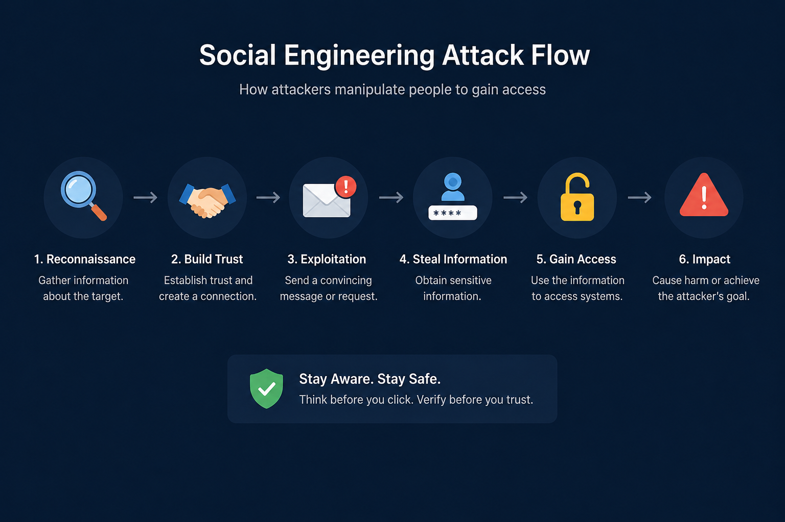

# Day 36 - Social Engineering

## What It Is
Social Engineering is the practice of manipulating people into revealing confidential information or performing actions that compromise security — without ever touching a single line of code. Instead of exploiting software vulnerabilities, social engineers exploit human psychology: trust, authority, urgency, fear, and helpfulness. It's consistently responsible for the majority of successful cyberattacks because no matter how strong your technical defenses are, humans remain the most exploitable attack surface.

## How It Works
Social engineering attacks follow a predictable psychological framework — establish trust, create a pretext, exploit a human bias, and extract what you need. The attacker researches the target first (OSINT, LinkedIn, company website) to make the attack believable.




Core psychological principles exploited:

```
Authority     - people comply with those who appear to be in positions of power
               "This is the IT department, we need your credentials to fix your account"

Urgency       - time pressure bypasses rational thinking
               "Your account will be suspended in 30 minutes unless you verify now"

Social Proof  - people follow what others around them do
               "Everyone else on your team has already completed this verification"

Reciprocity   - people feel obligated to return favors
               Attacker provides something helpful first, then makes a request

Liking        - people comply more with those they like or relate to
               Building rapport before making the actual malicious request

Fear          - threat of negative consequences drives hasty action
               "Your system is infected, click here immediately to fix it"
```

## Real-World Example
The 2020 Twitter hack is one of the most famous social engineering attacks in recent history. Attackers called Twitter employees posing as the internal IT department, convincing them to provide credentials to an internal admin tool. Once inside, they took over verified accounts including Barack Obama, Elon Musk, and Apple to run a Bitcoin scam. The entire attack bypassed all of Twitter's technical security infrastructure — no vulnerability was exploited, no code was written. A phone call and a convincing pretext was all it took to compromise one of the world's most high profile platforms.

## Why It Matters
From an attacker's side, social engineering is the most cost-effective attack vector — it requires no technical knowledge, no expensive tools, and bypasses even the most sophisticated technical defenses. A single successful phishing email or phone call can hand over credentials that would take weeks to crack technically.

From a defender's side, the only real defense is a combination of security awareness training (teaching employees to recognize and resist manipulation), strict verification procedures (never provide credentials over phone/email regardless of who's asking), and a security culture where employees feel safe reporting suspicious interactions without fear of embarrassment.

## Key Terms
- Social Engineering: manipulating people through psychological tactics to bypass security controls
- Pretexting: creating a fabricated scenario to manipulate a target into providing information or access
- Vishing (Voice Phishing): social engineering conducted over the phone
- Phishing: social engineering conducted via email to steal credentials or deliver malware
- Security Awareness Training: educating employees to recognize and resist social engineering attempts

## One Tip / Tool

Tool: `SET (Social Engineering Toolkit)` — an open source framework for simulating social engineering attacks in authorized penetration tests

```bash
# launch SET
sudo setoolkit

# SET menu options:
# 1) Social-Engineering Attacks
# 2) Penetration Testing (Fast-Track)
# 3) Third Party Modules

# Common SET attack vectors:
# - Spear-Phishing Attack Vectors
# - Website Attack Vectors (credential harvesting clone sites)
# - SMS Spoofing Attack Vectors
```

The single most effective defense against social engineering is a simple rule — **verify through a separate channel**. If someone calls claiming to be IT and asks for your password, hang up and call the IT department's known number directly. If you receive an urgent email from your CEO asking for a wire transfer, call them directly before acting. Breaking the attacker's communication channel breaks the attack. Only use SET in authorized engagements — simulating social engineering without permission is illegal.
