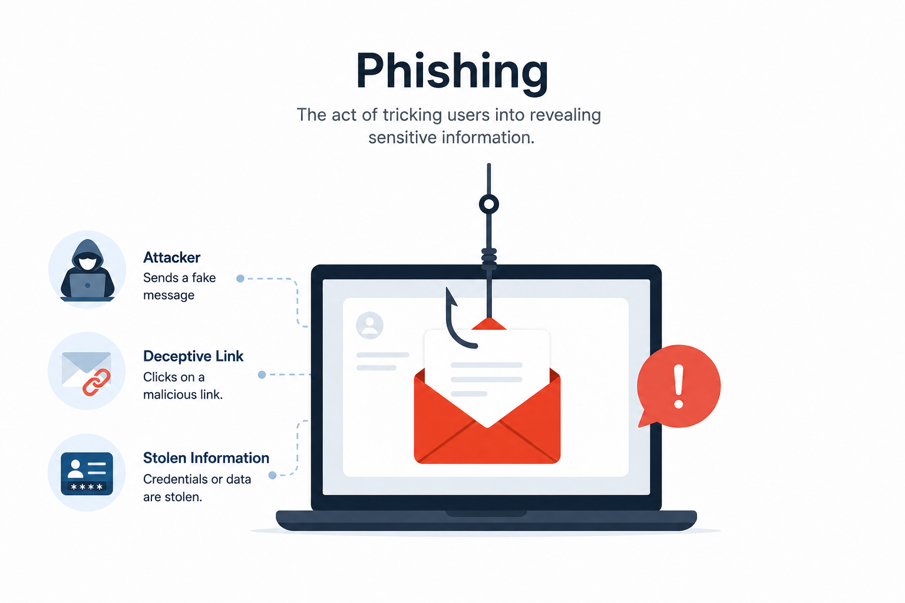

# Day 37 - What is Phishing?

## What It Is
Phishing is a type of social engineering attack where an attacker impersonates a trusted entity — a bank, a company, a colleague, or a government body — to trick victims into revealing sensitive information like passwords, credit card numbers, or personal data, or into taking a harmful action like clicking a malicious link or downloading malware. The name comes from "fishing" — casting a wide net and waiting for someone to take the bait. It's the single most common initial access vector in cyberattacks worldwide, responsible for over 90% of data breaches according to multiple industry reports.

## How It Works
Every phishing attack follows a basic structure regardless of the delivery method:



```
Step 1 — Reconnaissance
Attacker identifies the target (individual, organization, or broad population)
Gathers info: email addresses, company names, logos, employee names

Step 2 — Lure Creation
Crafts a convincing message impersonating a trusted entity
Uses urgency, fear, or authority to pressure quick action
Includes a malicious element: link, attachment, or request

Step 3 — Delivery
Sends the lure via email, SMS, phone call, social media, or other channel

Step 4 — Exploitation
Victim clicks the link → lands on a fake login page → credentials stolen
Victim opens attachment → malware executes on their machine
Victim follows instructions → transfers money or reveals sensitive info

Step 5 — Action on Objective
Attacker uses stolen credentials to access accounts
Deploys malware for persistence (day 18-20)
Moves laterally through the network (day 17)
```

Common phishing indicators:
```
- Sender email domain doesn't match the real organization
  (support@paypa1.com instead of support@paypal.com)
- Generic greeting ("Dear Customer" instead of your name)
- Urgent or threatening language ("Your account will be closed in 24 hours")
- Suspicious links (hover over reveals different URL than displayed)
- Unexpected attachments
- Requests for sensitive information via email
```

## Real-World Example
In 2016, John Podesta (Hillary Clinton's campaign chairman) fell victim to a phishing email disguised as a Google security alert asking him to change his password. A campaign aide incorrectly told him the email was "legitimate" when they meant to say "illegitimate." Podesta clicked the link, entered his credentials on a fake Google page, and handed over access to his entire Gmail account. The emails were subsequently leaked and became one of the most significant data breaches in US political history — all from one convincing phishing email.

## Why It Matters
From an attacker's side, phishing requires minimal technical skill and can be launched at massive scale cheaply. A single successful phish can hand over credentials, deploy malware, or initiate financial fraud that bypasses all technical defenses entirely.

From a defender's side, technical controls like email filtering, anti-spoofing protocols (SPF, DKIM, DMARC), and multi-factor authentication significantly reduce phishing impact. But the most important defense is user awareness — teaching people to slow down, verify sender identity, and never enter credentials on a page reached through an email link.

## Key Terms
- Phishing: impersonating a trusted entity to trick victims into revealing information or taking harmful actions
- Lure: the convincing fake message or scenario the attacker creates to deceive the victim
- Credential Harvesting: capturing usernames and passwords through fake login pages
- SPF/DKIM/DMARC: email authentication protocols that help prevent email spoofing and impersonation
- MFA (Multi-Factor Authentication): requiring a second factor beyond a password, significantly limiting the damage of stolen credentials

## One Tip / Tool

Tool: `GoPhish` — an open source phishing simulation framework used by security teams to run authorized phishing awareness campaigns

```bash
# install GoPhish
wget https://github.com/gophish/gophish/releases/download/v0.12.1/gophish-v0.12.1-linux-64bit.zip
unzip gophish-v0.12.1-linux-64bit.zip
./gophish

# GoPhish provides:
# - Email campaign management
# - Landing page cloning
# - Real time tracking of who clicked, who entered credentials
# - Reporting for security awareness training results
```

Only use GoPhish for authorized security awareness campaigns within your own organization. Running phishing simulations against people without authorization is illegal. The goal of phishing simulation in a defensive context is to identify which employees need additional security awareness training before a real attacker finds them first.
