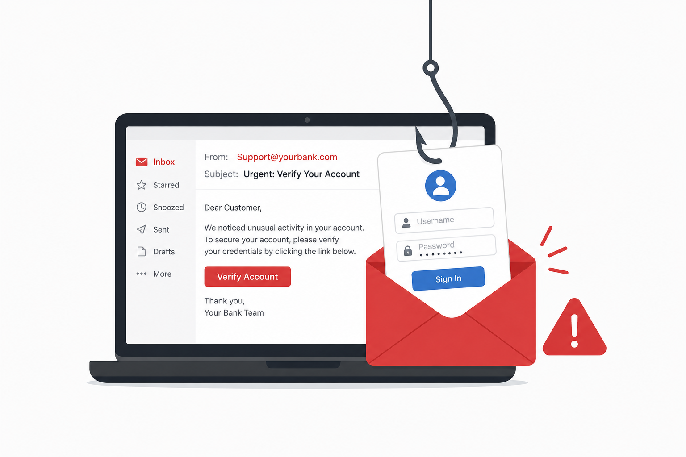

# Day 38 - Email Phishing

## What It Is
Email Phishing is the most common form of phishing where attackers send fraudulent emails impersonating legitimate organizations — banks, tech companies, government agencies, or internal IT departments — to trick recipients into clicking malicious links, downloading malware, or providing sensitive information. It's the oldest and most widely used cyberattack delivery method, accounting for the majority of all phishing attacks globally. Despite being well known, it remains devastatingly effective because attackers continuously refine their techniques to bypass both technical filters and human suspicion.

## How It Works
A phishing email is engineered to look as legitimate as possible while hiding its malicious intent. Attackers abuse several techniques to make emails convincing:



```
Email Spoofing Techniques:
- Display name spoofing: "PayPal Security" <attacker@gmail.com>
  The name looks legitimate but the actual address reveals the fraud

- Lookalike domains: support@paypa1.com, security@arnazon.com
  Characters replaced with visually similar ones (1 instead of l, rn instead of m)

- Subdomain abuse: paypal.com.attacker-site.com
  Real brand name appears in the URL but the actual domain is attacker-site.com

- Legitimate service abuse: sending phishing content through 
  Google Docs, OneDrive, or Dropbox links that pass email filters
  since the sending domain is genuinely legitimate

Common email phishing templates:
- Account suspension notices ("Your account has been compromised")
- Package delivery notifications ("Your delivery failed, click to reschedule")
- Invoice or payment requests ("Invoice #1234 attached, payment due today")
- IT department requests ("Required: update your password before Friday")
- Prize notifications ("You've been selected, claim your reward")
```

Technical delivery infrastructure:
```bash
# Attackers use tools like swaks to test email delivery
swaks --to victim@company.com --from ceo@company-spoofed.com \
      --server mail.attacker.com --body "Urgent: reset your password"

# Anti-spoofing checks attackers try to bypass:
# SPF  - checks if sender IP is authorized to send for that domain
# DKIM - cryptographic signature verifying email wasn't tampered with
# DMARC - policy defining what to do with emails failing SPF/DKIM
```

## Real-World Example
In 2014, Sony Pictures was breached partly through a spear phishing email campaign where employees received convincing emails appearing to come from Apple asking them to verify their Apple ID credentials. Once attackers had employee credentials they used them to move through Sony's network, eventually exfiltrating terabytes of unreleased films, executive emails, salary information, and employee personal data. The breach caused an estimated $100 million in damages — initiated by employees entering credentials on a fake Apple login page reached through a phishing email.

## Why It Matters
From an attacker's side, email phishing is cheap, scalable, and highly effective. A single phishing campaign can target thousands of people simultaneously with minimal cost. Even a 0.1% success rate on 100,000 emails means 100 compromised accounts.

From a defender's side, implementing SPF, DKIM, and DMARC on your email domain prevents attackers from spoofing your organization's domain to target your own employees or partners. Email security gateways filter known malicious senders and attachments. User training to recognize the common indicators — mismatched sender addresses, urgent language, suspicious links — remains the most critical layer since no technical filter catches everything.

## Key Terms
- Email Spoofing: forging the sender address of an email to make it appear to come from a trusted source
- SPF (Sender Policy Framework): a DNS record that specifies which mail servers are authorized to send email for a domain
- DKIM (DomainKeys Identified Mail): adds a cryptographic signature to emails allowing receivers to verify they weren't tampered with
- DMARC (Domain-based Message Authentication Reporting and Conformance): a policy that tells receiving mail servers what to do with emails that fail SPF or DKIM checks
- Lookalike Domain: a domain registered to visually resemble a legitimate one, used to deceive victims

## One Tip / Tool

Tool: `checkphish.ai` for analyzing suspicious URLs and `MXToolbox` for checking SPF/DKIM/DMARC configuration

```bash
# check if a domain has proper anti-spoofing records configured
# using MXToolbox (web based) or dig command line:

# check SPF record
dig TXT yourdomain.com | grep spf

# check DMARC record
dig TXT _dmarc.yourdomain.com

# check DKIM record
dig TXT selector._domainkey.yourdomain.com
```

A quick way to spot a phishing email before clicking anything — hover over every link in the email and check the actual URL that appears in your browser's status bar. The displayed text might say `https://paypal.com/secure` but the real URL revealed on hover might be `https://paypa1.com/login` or something entirely different. That one habit alone prevents the majority of email phishing attacks from succeeding.
