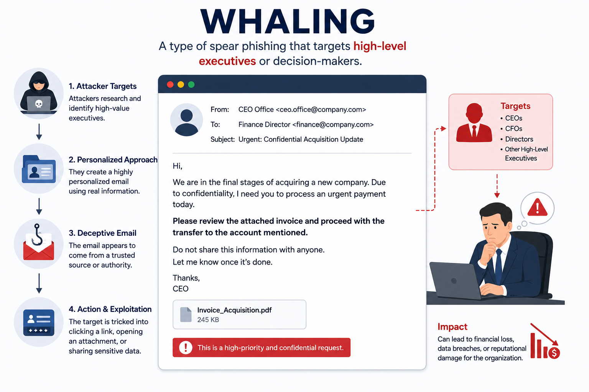

# Day 40 - Whaling

## What It Is
Whaling is a highly targeted spear phishing attack (day 39) specifically aimed at senior executives and high-value individuals — CEOs, CFOs, board members, legal counsel, and other C-suite targets. The name comes from "going after the big fish." Because executives have high-level access to sensitive systems, financial accounts, and confidential data, successfully phishing one of them can be catastrophically more damaging than targeting a regular employee. The attack is tailored to the executive's specific role, responsibilities, and the kinds of requests they regularly deal with.

## How It Works
Whaling attacks are more sophisticated and time-consuming than regular spear phishing because the target is high value and more security-aware. Attackers research the executive extensively before striking.



```
What makes whaling different from regular spear phishing:

Target profile research:
- Executive's name, title, direct reports, and board relationships
- Company financials, recent earnings calls, press releases
- Pending mergers, acquisitions, or major contracts
- Executive's travel schedule (often public or inferable)
- Personal details from LinkedIn, interviews, conference talks

Common whaling pretexts:
- Legal subpoenas ("You are required to appear regarding case #4821")
- Tax authority notices ("Urgent: IRS compliance required by Friday")
- Board-level requests ("Confidential: board resolution requires your signature")
- Merger/acquisition documents ("NDA attached for Project Falcon - do not forward")
- Urgent wire transfer requests from a "trusted partner" or "board member"
```
Attack flow:
```
1. Attacker researches target executive for days or weeks via OSINT
2. Crafts an extremely convincing email referencing real company events
3. Often impersonates lawyers, auditors, regulators, or other executives
4. Creates urgency and confidentiality ("do not discuss with colleagues")
5. Requests immediate action: wire transfer, credential entry, document signing
6. Uses legitimate-looking domains and professional language throughout
```

## Real-World Example
In 2016, Snapchat's payroll department received a whaling email impersonating CEO Evan Spiegel. The email requested employee payroll data — W-2 forms, salary information, and personal details for around 700 employees. The request was fulfilled before anyone verified it was legitimate. No systems were hacked, no malware was deployed. An email impersonating the CEO, sent to the right person, was enough to cause a significant data breach affecting hundreds of employees whose personal information was then exposed.

This same pattern — impersonating a CEO to request wire transfers or sensitive data — is so common it has its own name: CEO Fraud, a subset of Business Email Compromise (BEC, covered on day 43).

## Why It Matters
From an attacker's side, one successful whaling attack can yield significantly more value than dozens of regular phishing attacks — executives have access to financial systems, legal documents, M&A information, and can authorize large wire transfers that lower-level employees cannot.

From a defender's side, executives are often the hardest to train on security awareness because they're busy, have assistants handling communications on their behalf, and sometimes resist security policies that slow them down. Effective defenses include dedicated executive security awareness briefings, strict financial verification procedures requiring multi-person authorization for any wire transfer, and out-of-band verification (always calling directly before acting on any email requesting sensitive action).

## Key Terms
- Whaling: a spear phishing attack specifically targeting senior executives and high-value individuals
- CEO Fraud: a specific type of whaling where the attacker impersonates the CEO to authorize fraudulent wire transfers or data requests
- C-Suite: the group of senior executives in an organization — CEO, CFO, CTO, COO, CISO etc.
- Out-of-band Verification: confirming a request through a completely separate communication channel (calling directly) rather than replying to the suspicious message
- Business Email Compromise (BEC): a broader category of attacks targeting businesses through email fraud, often involving whaling techniques

## One Tip / Tool

Tool: `Hunter.io` and `LinkedIn` for understanding executive exposure, and strict **dual authorization policies** as the primary defense

```
Dual Authorization Rule for wire transfers:
- Any transfer over a set threshold requires approval from TWO separate people
- Both approvals must happen through verified channels (not email alone)
- Callback verification: always call the requestor on a known phone number
  before processing any unusual financial request received via email

This single policy prevents the majority of CEO fraud and whaling
financial attacks regardless of how convincing the email appears.
```

The most important organizational defense against whaling is a culture where any employee — regardless of seniority of the requestor — feels empowered to pause and verify before acting on an unusual email request. Attackers specifically count on the psychological pressure of "my CEO asked me to do this urgently" to bypass rational verification. Breaking that pressure with clear policy is the defense.
