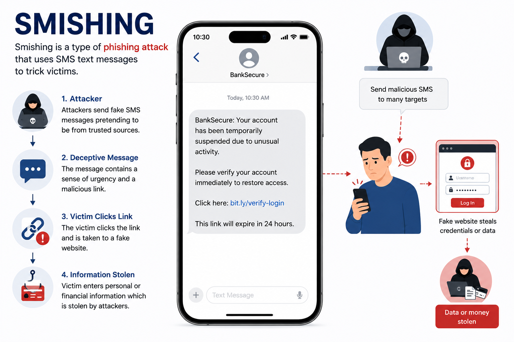

# Day 41 - Smishing

## What It Is
Smishing (SMS Phishing) is a phishing attack delivered through text messages instead of email. Attackers send fraudulent SMS messages impersonating banks, delivery companies, government agencies, or popular services to trick victims into clicking malicious links or calling fake numbers. The name combines "SMS" and "phishing." Smishing has grown significantly as smartphone usage increased — people tend to trust text messages more than emails and are less likely to scrutinize them carefully, making smishing increasingly effective compared to email phishing.

## How It Works
Smishing exploits the inherent trust people place in SMS messages and the limited context available on a mobile screen — you often can't hover over links to preview URLs, and sender information is easier to spoof or mask.



```
Common smishing pretexts:
- Package delivery: "Your USPS package could not be delivered.
  Track here: usps-delivery-update.com/track"

- Bank alerts: "ALERT: Unusual activity detected on your account.
  Verify immediately: secure-bankname-alert.com"

- Government notices: "IRS: You have a pending tax refund of $847.
  Claim before expiry: irs-refund-claim.net"

- Prize notifications: "You've won a $500 gift card!
  Claim in 24hrs: reward-claim-now.com"

- Two-factor bypass: "Your verification code is 847291.
  If you didn't request this reply STOP"
  (social engineering to get the victim to reveal their 2FA code)
```
Technical delivery methods:
```
SMS Spoofing    - sending SMS from a fake sender ID showing a bank name
                  or short code instead of a real phone number
SIM Swapping    - more advanced, convincing carrier to transfer victim's
                  number to attacker's SIM, intercepting all their SMS
Smishing Kits   - pre-built tools that automate sending bulk smishing
                  campaigns with tracking links
```
## Real-World Example
In 2022 a large scale smishing campaign targeted customers of major UK banks. Victims received text messages appearing to come from their bank's official short code (the same number the real bank uses) warning of suspicious account activity. Clicking the link led to a convincing fake banking login page. The campaign was particularly effective because the fake messages appeared in the same SMS thread as genuine bank messages on victims' phones — since SMS spoofing allows using the same sender ID the real bank uses. Thousands of victims entered their banking credentials before the campaign was identified and taken down.

## Why It Matters
From an attacker's side, smishing bypasses many email security controls entirely since it goes directly to the victim's phone. Mobile screens show less context than desktop browsers, making malicious URLs harder to spot. People check texts faster and with less scrutiny than emails, and response rates to SMS messages are significantly higher than email.

From a defender's side, never click links in unsolicited text messages regardless of how legitimate they appear. Always navigate directly to the official website or app instead. Banks and government agencies will never ask for credentials or sensitive information via SMS link. Registering your number on do-not-call lists reduces some smishing volume, and carrier-level spam filtering is improving but remains far behind email filtering in effectiveness.

## Key Terms
- Smishing (SMS Phishing): phishing attacks delivered via SMS text messages
- SMS Spoofing: sending text messages with a fake sender ID to impersonate a legitimate organization
- SIM Swapping: convincing a mobile carrier to transfer a victim's phone number to an attacker-controlled SIM card
- Smishing Kit: pre-packaged tools that automate bulk smishing campaign delivery and credential harvesting
- Sender ID: the name or number displayed as the sender of an SMS message, easily spoofed in many countries

## One Tip / Tool

Tool: `Vonage SMS API` and similar services are what attackers abuse for bulk smishing — for defenders, **carrier reporting** is the primary response tool

```
If you receive a smishing message:
1. Do NOT click any links
2. Do NOT call any numbers in the message
3. Go directly to the official website or app instead
4. Report the number:
   - In the US: forward to 7726 (SPAM) — reports to your carrier
   - Report to the FTC at reportfraud.ftc.gov
   - Report to the organization being impersonated directly

For organizations being impersonated:
- Register brand name with carriers through SMS sender ID protection programs
- Monitor for lookalike domains being used in smishing campaigns
- Publish clear communication: "We will never send you links via SMS"
```

The single best defense against smishing — treat every unsolicited text message link with the same suspicion you'd apply to an email link. If your bank texts you about suspicious activity, open your banking app directly or call the number on the back of your card. Never use the link or number provided in the text itself.
