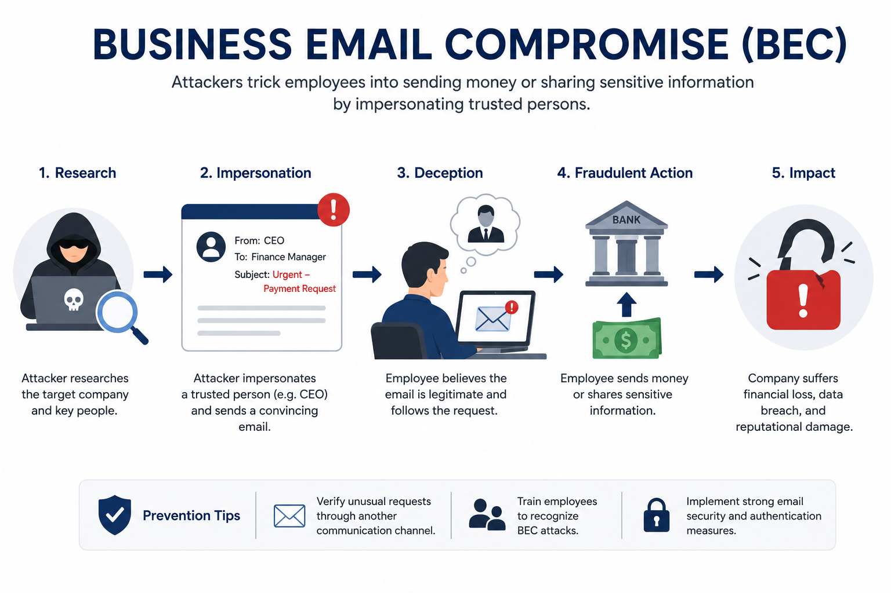

# Day 44 - Business Email Compromise (BEC)

## What It Is
Business Email Compromise (BEC) is a sophisticated email fraud attack where attackers impersonate trusted business contacts — executives, vendors, lawyers, or partners — to manipulate employees into transferring money, revealing sensitive data, or changing payment details. Unlike most phishing attacks that target individuals for personal credentials, BEC specifically targets organizations for financial fraud. The FBI consistently ranks BEC as the costliest cybercrime category globally, with billions of dollars lost annually — far exceeding losses from ransomware.

## How It Works
BEC attacks don't always require malware or technical exploits. They rely on convincing impersonation and carefully timed requests that align with real business processes.



```
Five main BEC categories (FBI classification):

1. CEO Fraud
Executive impersonation requesting urgent wire transfers
"I'm in a board meeting and need you to wire $85,000 to this 
account immediately. This is confidential, don't discuss with anyone."

2. Vendor/Supplier Fraud
Impersonating a known vendor to change payment details
"Please update our bank account for future invoice payments 
to the new account below — our old account is being closed."

3. Attorney Impersonation
Fake lawyer claiming urgency around legal matters
"As legal counsel handling the acquisition, I need you to 
transfer the escrow funds today before close of business."

4. Data Theft
Requesting employee PII, W-2 forms, or sensitive records
"I need all employee tax records for the audit by end of day."

5. Account Compromise
Attacker gains access to a real business email account
Sends fraudulent requests from the legitimate address
Most dangerous — passes all technical email authentication checks

Attack flow:
Recon (LinkedIn, company website) → Identify financial decision makers
→ Craft convincing business pretext → Create urgency + confidentiality
→ Request wire transfer or sensitive data → Funds sent before verification
```

## Real-World Example
In 2019, Toyota Boshoku Corporation, a Toyota supplier, lost $37 million in a single BEC attack. Attackers impersonated a business partner and convinced an employee in the finance department to change the bank account details for an ongoing transaction. The fraudulent transfer was processed before the fraud was detected. No malware was involved, no systems were hacked — just a convincing email from someone impersonating a trusted business contact at exactly the right moment in an ongoing financial transaction.

## Why It Matters
From an attacker's side, BEC is extremely high return with relatively low technical effort — no malware to develop, no vulnerabilities to find. A convincing email sent at the right moment to the right person can yield millions. Wire transfers are often irreversible, and international transfers make recovery extremely difficult even when fraud is quickly detected.

From a defender's side, the core defenses are procedural rather than technical. No single email request should be sufficient to authorize a wire transfer or change payment details — all such requests must be verified through a separate, known phone number. Finance teams should be specifically trained on BEC scenarios, and any request that combines urgency with a request for money or data changes should trigger automatic verification regardless of who the apparent sender is.

## Key Terms
- BEC (Business Email Compromise): email fraud targeting organizations to initiate fraudulent wire transfers or data theft by impersonating trusted contacts.
- CEO Fraud: a BEC variant where the attacker impersonates the CEO to pressure employees into unauthorized transfers.
- Account Takeover: gaining actual access to a legitimate business email account, enabling BEC attacks that bypass technical email authentication.
- Wire Fraud: using electronic communications to fraudulently obtain money — BEC attacks typically constitute wire fraud under US law.
- Callback Verification: calling a vendor or executive on a known, pre-existing phone number to confirm any unusual financial request before processing.

## One Tip / Tool

Tool: **Dual authorization + callback verification** — the most effective BEC defense, not a software tool

```
BEC Prevention Checklist for Finance Teams:

1. Any payment request received via email requires phone verification
   Call the requestor on a number from your existing records
   Never use a phone number provided in the suspicious email itself

2. Any change to vendor payment/banking details requires:
   - Written request from the vendor on their official letterhead
   - Callback verification to the vendor's known contact number
   - Approval from at least two people in finance

3. Red flags that should trigger immediate verification:
   - Urgency combined with a request to keep it confidential
   - Request to bypass normal approval processes "just this once"
   - New bank account details for an existing vendor or partner
   - Executive requesting a transfer while "traveling" or "in meetings"

4. Email security: implement DMARC, DKIM, SPF (day 38) to prevent
   your own domain from being spoofed in BEC attacks targeting your partners
```

BEC losses are largely unrecoverable once wire transfers are sent — prevention through process is far more effective than any technical control. The FBI's Internet Crime Complaint Center (IC3) at ic3.gov is the reporting destination for BEC incidents in the US, and rapid reporting gives the best chance of fund recovery through the Financial Fraud Kill Chain program.
