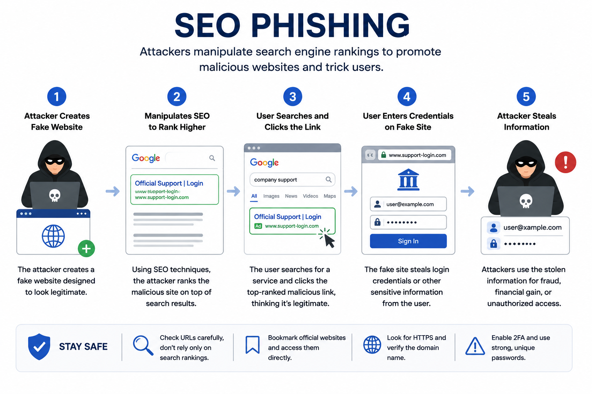

# Day 46 - Search Engine Phishing (SEO Phishing)

## What It Is
SEO Phishing (Search Engine Phishing) is an attack where criminals create malicious websites optimized to rank high in search engine results for terms people commonly search — like "bank login", "PayPal sign in", or "Netflix account". When a victim searches for a legitimate service and clicks what appears to be the top result, they land on a convincing fake page designed to steal their credentials. Unlike most phishing attacks that come to the victim, SEO phishing waits for the victim to come to it — making it particularly insidious because the victim initiated the search themselves.

## How It Works
SEO phishing exploits user trust in search engine results — most people assume top results are legitimate, especially if they appear in paid ad spots or on the first page of organic results.



```
Two main delivery methods:

1. Malicious Paid Ads (most common currently)
Attackers purchase Google/Bing ads for high-value search terms
Ad appears above organic results with a URL that looks legitimate
Victim clicks the ad thinking it's the real site
Lands on a pixel-perfect clone of the real login page

Example:
Search: "chase bank login"
Ad result: "Chase Bank — Secure Login | chase-secure-login.com"
Real site: chase.com
The ad URL looks related but is a completely different domain

2. Organic SEO Manipulation
Creating content-rich fake pages that rank organically over time
Optimizing for long-tail keywords like "how to login to my wells fargo account"
Takes longer but costs nothing and is harder to take down quickly
Often uses compromised legitimate websites to host phishing content
```

Technical tactics attackers use:
```
- Typosquatting: registering domains with common misspellings
  (gooogle.com, paypa1.com, arnazon.com)
- Combosquatting: adding words to legitimate brand names
  (paypal-secure.com, apple-id-verify.com)
- Homograph attacks: using Unicode characters that look identical
  to ASCII (using Cyrillic 'а' instead of Latin 'a' in a domain)
- Ad cloaking: showing search engines a legitimate page during
  review but redirecting real visitors to the phishing page
```
## Real-World Example
In 2022 and 2023, security researchers documented widespread SEO phishing campaigns targeting cryptocurrency users. Fake pages for popular crypto wallets and exchanges appeared as sponsored ads in search results — sometimes above the legitimate site's own ads. Users searching to access their crypto accounts clicked these ads, entered their seed phrases or passwords on convincing clones, and lost their entire holdings. The FBI issued warnings specifically about this pattern after millions of dollars in cryptocurrency were stolen through search engine phishing campaigns targeting crypto platforms.

## Why It Matters
From an attacker's side, SEO phishing requires no email list, no SMS campaign, and no social media monitoring. The search engine delivers victims organically. Paid ads can be set up in minutes and target exactly the people actively looking to log into a service — the highest-intent victims possible.

From a defender's side, always type the URL of important services directly into your browser rather than searching for them. Bookmark your bank, email provider, crypto exchange, and other frequently used services. Never click ads to reach a login page — navigate directly. Browser extensions like uBlock Origin block many malicious ads before they're visible. Organizations can monitor for brand impersonation in search ads and report them to search engines for takedown.

## Key Terms
- SEO Phishing: creating fake websites optimized to appear in search results for brand-related queries
- Typosquatting: registering domains with deliberate misspellings of legitimate brand names to capture mistyped URLs
- Combosquatting: adding words like "secure", "login", or "verify" to a legitimate brand name in a domain
- Ad Cloaking: showing search engine crawlers a legitimate page while serving the actual phishing page to real visitors
- Homograph Attack: using visually identical Unicode characters to create domains that look identical to legitimate ones

## One Tip / Tool

Tool: `URLScan.io` and `DNSTwist` for identifying typosquatting and lookalike domains targeting your brand

```bash
# DNSTwist - find all lookalike domains for a target brand
pip install dnstwist
dnstwist paypal.com

# output shows all possible typosquatting/combosquatting variants
# and whether they're currently registered and active
# use this to monitor for new phishing domains targeting your organization

# URLScan.io (web based) - scan a suspicious URL before visiting
# https://urlscan.io - paste any suspicious URL to see what it actually loads
# without visiting it directly from your browser
```

The single most effective personal defense against SEO phishing — bookmark every service you log into regularly and never use a search engine to find a login page. The 10 seconds it takes to bookmark a site is worth far more than the risk of clicking the wrong search result one day. Treat search results for login pages the same way you'd treat an unsolicited email link — with suspicion until verified.
