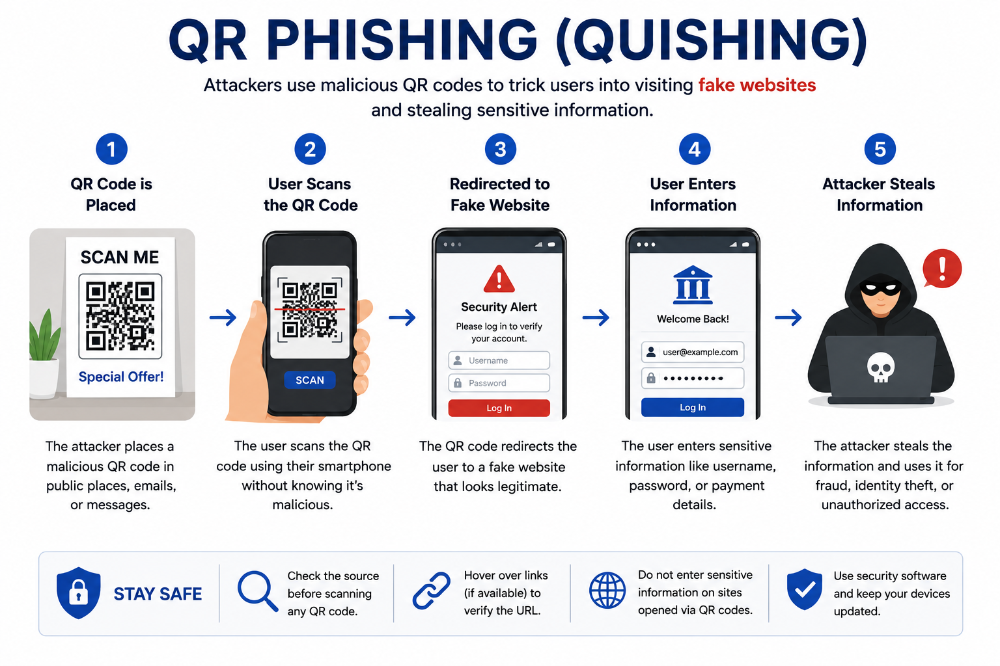

# Day 47 - QR Phishing (Quishing)

## What It Is
Quishing (QR Code Phishing) is a phishing attack that uses malicious QR codes to redirect victims to fake websites designed to steal credentials, deliver malware, or harvest personal information. Instead of embedding a malicious link in an email or text that security tools can scan and flag, attackers embed the malicious URL inside a QR code — an image — which most email security gateways and endpoint protection tools cannot inspect. The victim scans the QR code with their phone, bypassing all desktop security controls entirely, and lands on a phishing page on their mobile device where they have fewer security tools protecting them.

## How It Works
QR codes are essentially just encoded URLs. Attackers generate a QR code pointing to a malicious domain and distribute it through email, physical placement, or document replacement.



```
Delivery methods:

Email-based Quishing
Attacker sends an email with a QR code image instead of a link
"Scan this QR code to verify your Microsoft account"
"Your package is held — scan to confirm delivery address"
Email security tools scan for malicious URLs in text and hyperlinks
But they typically cannot decode and inspect URLs inside image-based QR codes
The malicious URL passes through undetected

Physical Quishing
Attackers place fake QR code stickers over legitimate ones in public
Parking meters, restaurant menus, EV charging stations, posters
Victim scans what they think is the official QR code
Gets redirected to a payment harvesting or credential phishing page

Document Replacement
Fake invoices or forms with QR codes sent to finance departments
"Scan to view and approve this invoice"
Redirects to a BEC-style credential harvesting page (day 44)
```

Attack flow:
```
1. Attacker creates a convincing phishing page on a lookalike domain
2. Generates a QR code encoding the malicious URL
3. Embeds the QR code in an email, document, or physical material
4. Victim scans with their phone — bypasses desktop security tools
5. Mobile browser opens the phishing page
6. Victim enters credentials on mobile — where MFA prompts are
   easier to intercept and security awareness is often lower
```

## Real-World Example
In 2023 a large scale quishing campaign targeted employees of major energy companies in the United States. Attackers sent phishing emails containing QR codes claiming to update Microsoft 365 security settings. Because the malicious URL was encoded in an image rather than a clickable link, it bypassed the organizations' email security gateways entirely. Once scanned, victims were taken to a convincing Microsoft login page on their phones where they entered their credentials — including MFA codes that attackers used in real time to complete account takeovers. The campaign was notable for specifically choosing QR codes to defeat email security tools, showing a direct evolution in attacker techniques to bypass improving defenses.

## Why It Matters
From an attacker's side, quishing is a direct response to improving email security. As organizations get better at detecting malicious links in emails, moving the payload into an image that security tools can't inspect is a logical evolution. The mobile device pivot also means victims are on a platform with fewer enterprise security controls and a different (often less cautious) security mindset.

From a defender's side, email security tools are increasingly adding QR code decoding capabilities to inspect the embedded URLs — but adoption is still catching up to the threat. Security awareness training should specifically cover quishing since most people have been trained to be suspicious of email links but not QR codes. Never scan a QR code received in an unsolicited email. For physical QR codes, check for stickers placed over the original code and verify the URL before proceeding.

## Key Terms
- Quishing (QR Phishing): using malicious QR codes to redirect victims to phishing pages, bypassing email security tools that can't inspect image-encoded URLs
- QR Code: a two-dimensional barcode that encodes information (typically a URL) readable by a camera
- Image-based Evasion: hiding malicious content inside images to bypass security tools that scan only text-based content
- Mobile Phishing: phishing attacks specifically targeting mobile devices where security controls are often weaker
- Real-time Phishing: capturing MFA codes the moment they're entered and using them immediately before they expire

## One Tip / Tool

Tool: `QRLJacker` for understanding QR phishing in lab environments, and **QR code preview** as the primary personal defense

```
How to safely handle QR codes:

Before scanning any QR code:
1. Is the QR code in an unsolicited email? Don't scan it.
2. Is the QR code a sticker that looks like it might be placed over something? Don't scan it.
3. Does the physical location make sense for a QR code? Verify before scanning.

After scanning but before proceeding:
1. Check the URL your phone shows before opening it
2. Does the domain match the organization the QR code claims to be from?
3. Is it HTTPS? (necessary but not sufficient — attackers use HTTPS too)
4. When in doubt, type the organization's URL directly into your browser instead

For organizations:
- Train employees specifically on quishing — most phishing training skips QR codes
- Implement email security tools with QR code URL inspection capability
- Never use QR codes in internal security-sensitive communications
```

Quishing is a perfect example of how attacker techniques evolve in direct response to defensive improvements. Every time defenders get better at detecting one delivery method, attackers find a new channel. The underlying attack — fake login page stealing credentials — remains the same. Only the delivery mechanism changes.
