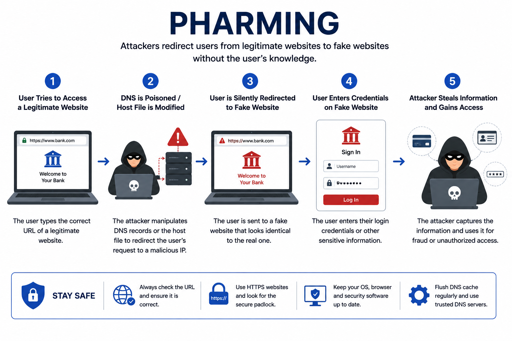

# Day 48 - Pharming

## What It Is
Pharming is an attack that redirects users to a fake malicious website without them clicking any suspicious link — even when they type the correct URL directly into their browser. Unlike phishing which requires the victim to click something, pharming corrupts the DNS resolution process itself, so typing "paypal.com" correctly takes you to an attacker-controlled fake page instead of the real one. It's considered more dangerous than regular phishing because the victim does everything right — they type the correct address — and still end up on a malicious site.

## How It Works
Pharming exploits the DNS (Domain Name System) infrastructure that translates domain names into IP addresses. There are two main attack methods:



```
Method 1 — Local Hosts File Poisoning
Every computer has a local hosts file that maps domain names to IPs
If an attacker can modify this file (via malware), they can redirect
any domain to their own server directly on the victim's machine

Location of hosts file:
Windows: C:\Windows\System32\drivers\etc\hosts
Linux/Mac: /etc/hosts

Poisoned hosts file example:
192.168.1.100   paypal.com      ← attacker's IP instead of PayPal's real IP
192.168.1.100   bankofamerica.com
192.168.1.100   gmail.com

Now any browser on this machine goes to 192.168.1.100 for these domains
regardless of what the user types in the address bar

Method 2 — DNS Server Poisoning (more dangerous, wider impact)
Attacker compromises or poisons a DNS resolver used by many people
Like DNS Spoofing (day 02) but specifically targeting financial/login sites
A single poisoned DNS server can redirect thousands of victims simultaneously
No malware needed on individual machines — the attack happens at the network level

Attack flow for DNS-based pharming:
1. Attacker compromises a DNS server or router's DNS settings
2. Inserts fake DNS records mapping legitimate domains to malicious IPs
3. Every user whose DNS queries go through that server gets redirected
4. Victims type correct URLs, get taken to fake login pages
5. Credentials harvested at scale with victims having no obvious indication
```

# Real-World Example
In 2007 one of the largest pharming attacks ever recorded targeted around 50 financial institutions simultaneously. Attackers sent users a malicious email that, when opened, executed a small script modifying the local hosts file on Windows machines. Once infected, victims who typed their bank's correct URL were silently redirected to convincing fake banking pages. The attack affected users across multiple countries and targeted dozens of banks at once — the hosts file modification meant even security-conscious users who carefully typed the correct URL were still redirected to the fake site.

More recently, pharming attacks have targeted home routers — attackers compromise poorly secured routers (default passwords, unpatched firmware) and change the router's DNS settings to point to attacker-controlled DNS servers, affecting every device on that network simultaneously without any malware on individual devices.

## Why It Matters
From an attacker's side, pharming is powerful precisely because it defeats the most common phishing defense — "just type the URL directly instead of clicking links." A victim can do everything correctly and still be compromised. Router-based pharming in particular can silently affect every device in a home or office without any per-device infection needed.

From a defender's side, HTTPS and certificate validation is the most important technical defense — a pharmed site will have a different SSL certificate than the real site, causing browsers to show a certificate warning. Never bypass certificate warnings on financial or sensitive sites. Using encrypted DNS (DNS over HTTPS or DNS over TLS) prevents DNS poisoning attacks. Keeping router firmware updated and changing default router credentials prevents router-based pharming. Checking your router's DNS settings periodically for unauthorized changes is a good security habit.

## Key Terms
- Pharming: redirecting users to malicious websites by corrupting DNS resolution rather than through deceptive links
- Hosts File: a local file on every computer that maps domain names to IP addresses, checked before DNS queries are made
- DNS Poisoning: injecting false records into a DNS resolver's cache to redirect domain lookups to attacker-controlled IPs
- Certificate Warning: a browser alert triggered when a site's SSL certificate doesn't match the expected domain — a key indicator of pharming
- DNS over HTTPS (DoH): encrypting DNS queries to prevent interception and manipulation by attackers on the network path

## One Tip / Tool

Tool: `dnschef` for understanding DNS manipulation in lab environments, and **checking your router DNS settings** as the primary personal defense

```bash
# check what DNS servers your machine is currently using
# Windows
ipconfig /all | findstr "DNS Servers"

# Linux/Mac
cat /etc/resolv.conf
# or
resolvectl status

# check your router's DNS settings:
# log into your router admin panel (usually 192.168.1.1 or 192.168.0.1)
# look for DNS settings under WAN or Internet configuration
# they should point to your ISP's DNS or a trusted provider like:
# 1.1.1.1 (Cloudflare) or 8.8.8.8 (Google)
# if they point to an unknown IP - your router may be compromised

# verify a site's real IP vs what your DNS is returning
nslookup paypal.com
# compare the returned IP with known legitimate IPs
```

The most important defense against pharming — never click through SSL certificate warnings on banking, email, or any sensitive site. A certificate mismatch is the technical system telling you that the site you're seeing is not the site you think it is, even if the URL in the address bar looks correct. That warning exists specifically to catch pharming and similar attacks.
