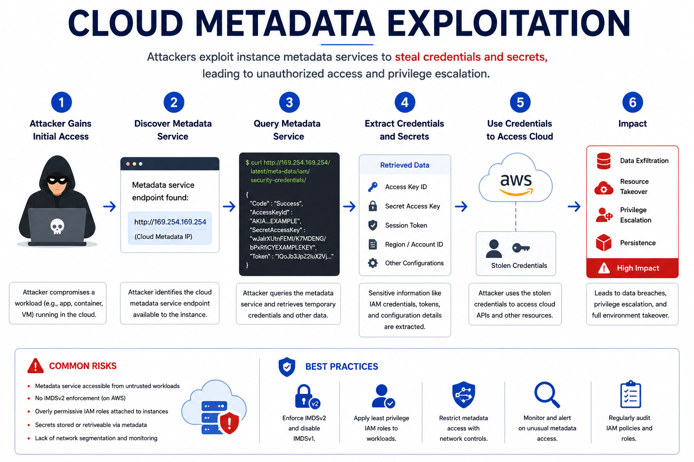

# Day 54 - Cloud Metadata Exploitation

## What It Is
Cloud Metadata Exploitation is an attack that abuses the instance metadata service — a special internal endpoint available on every cloud virtual machine that provides configuration data, credentials, and identity information to the running instance. In AWS, this endpoint lives at `http://169.254.169.254` and is accessible only from within the instance itself. When an attacker gains any form of server-side request forgery (SSRF, day 07) or code execution on a cloud instance, querying the metadata service is almost always the first thing they do — because it can hand over temporary AWS credentials with whatever permissions are attached to that instance's IAM role.

## How It Works
Every EC2 instance, Azure VM, and GCP compute instance has a metadata service accessible at a non-routable IP address that only the instance itself can reach. This service exists to give instances information about themselves without hardcoding it — things like the instance ID, region, security groups, and most critically, temporary IAM credentials.



```
AWS Instance Metadata Service (IMDS) endpoints:

# Basic instance information
curl http://169.254.169.254/latest/meta-data/

# Get the IAM role name attached to this instance
curl http://169.254.169.254/latest/meta-data/iam/security-credentials/

# Get temporary credentials for the attached IAM role
curl http://169.254.169.254/latest/meta-data/iam/security-credentials/ROLE-NAME
# Returns:

{
  "AccessKeyId": "ASIA...",
  "SecretAccessKey": "...",
  "Token": "...",
  "Expiration": "2024-01-15T12:00:00Z"
}

# User data — often contains startup scripts with hardcoded secrets
curl http://169.254.169.254/latest/user-data

Attack flow via SSRF:
1. Attacker finds SSRF vulnerability in a web application running on EC2
2. Points the SSRF at: http://169.254.169.254/latest/meta-data/iam/security-credentials/
3. Application fetches the URL server-side and returns the response
4. Attacker receives valid AWS temporary credentials
5. Uses credentials to access S3 buckets, other AWS services, escalate privileges
6. Full AWS account compromise possible depending on IAM role permissions

IMDSv2 — the fix AWS introduced:
# IMDSv1 (vulnerable) - simple GET request works
curl http://169.254.169.254/latest/meta-data/

# IMDSv2 (more secure) - requires a session token first
TOKEN=$(curl -X PUT "http://169.254.169.254/latest/api/token" \
  -H "X-aws-ec2-metadata-token-ttl-seconds: 21600")
curl -H "X-aws-ec2-metadata-token: $TOKEN" \
  http://169.254.169.254/latest/meta-data/

# IMDSv2 breaks simple SSRF exploitation because the PUT request
# typically can't be made through a basic SSRF vulnerability
```

## Real-World Example
The 2019 Capital One breach is the most famous example of cloud metadata exploitation — referenced earlier in day 07 (SSRF) and day 51 (Cloud Misconfigurations). The attacker exploited an SSRF vulnerability in Capital One's WAF running on EC2, used it to query `http://169.254.169.254` and retrieve temporary credentials for the instance's IAM role, then used those credentials to list and download from over 700 S3 buckets containing 100 million customer records. The metadata service handed over the keys to the kingdom through a single SSRF request. This breach directly led AWS to develop and strongly encourage migration to IMDSv2.

## Why It Matters
From an attacker's side, the metadata service is the highest-value target after gaining any foothold on a cloud instance — it provides ready-made credentials that work immediately without any further exploitation. Combined with SSRF it becomes a remote credential theft technique requiring no direct access to the instance at all.

From a defender's side, enforcing IMDSv2 on all EC2 instances is the most important mitigation — it adds a session token requirement that breaks simple SSRF-based metadata exploitation. This can be enforced at the account level through AWS Organizations policies and on individual instances through launch configuration. Additionally, scoping IAM role permissions tightly (day 53) limits the damage even if credentials are stolen — following the Capital One breach most security teams implemented both IMDSv2 enforcement and tighter IAM scoping as immediate remediations.

## Key Terms
- Instance Metadata Service (IMDS): a special internal endpoint at 169.254.169.254 providing configuration and credentials to cloud instances
- IMDSv1: the original metadata service version requiring only a simple GET request — vulnerable to SSRF-based exploitation
- IMDSv2: an improved metadata service requiring a session token obtained via PUT request before metadata can be accessed — significantly harder to exploit via SSRF
- Temporary Credentials: short-lived AWS access keys issued by the metadata service that expire automatically — less dangerous than permanent credentials but still powerful
- Link-local Address: the 169.254.0.0/16 IP range used for the metadata service — only accessible from within the instance, not routable on the internet

## One Tip / Tool

Tool: `aws-imds-packet-analyzer` and AWS CLI for checking and enforcing IMDSv2

```bash
# check if an EC2 instance requires IMDSv2
aws ec2 describe-instances --instance-ids i-1234567890abcdef0 \
  --query 'Reservations[].Instances[].MetadataOptions'

# enforce IMDSv2 on a running instance
aws ec2 modify-instance-metadata-options \
  --instance-id i-1234567890abcdef0 \
  --http-tokens required \
  --http-endpoint enabled

# enforce IMDSv2 across all new instances in an account via SCP
# (requires AWS Organizations)
{
  "Effect": "Deny",
  "Action": "ec2:RunInstances",
  "Condition": {
    "StringNotEquals": {
      "ec2:MetadataHttpTokens": "required"
    }
  }
}

# test if metadata is accessible from inside an instance
curl -s http://169.254.169.254/latest/meta-data/
# if it returns data without a token, IMDSv1 is still enabled
```

Practice cloud metadata exploitation safely on **CloudGoat** (Rhino Security Labs) or **flaws.cloud** — a free AWS security learning platform specifically designed around real-world cloud attack scenarios including metadata exploitation challenges.
