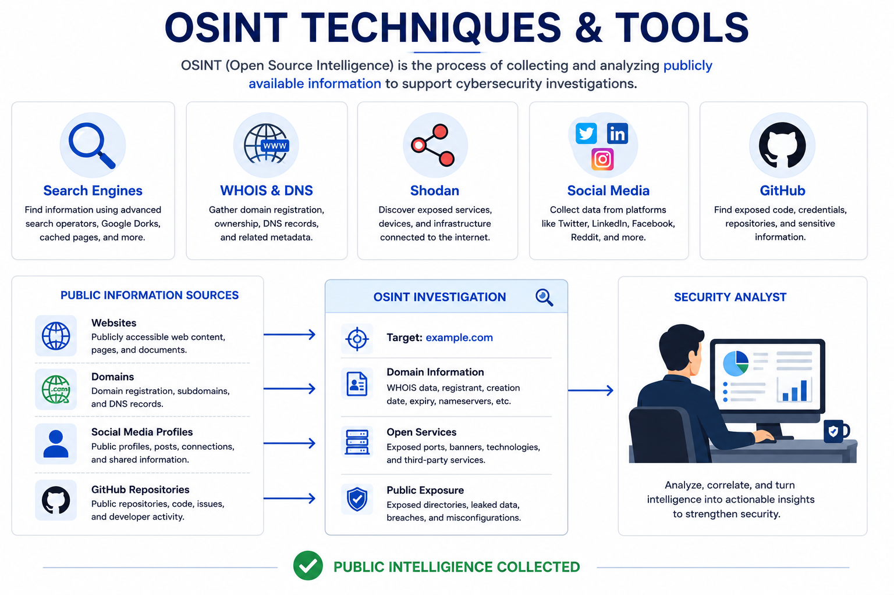

# Day 58 - OSINT Techniques & Tools

## What It Is
OSINT (Open Source Intelligence) is the practice of collecting and analyzing publicly available information to gather intelligence about a target — a person, organization, domain, or infrastructure. "Open source" doesn't mean software — it means the information sources are openly accessible to anyone: search engines, social media, public records, DNS data, job postings, code repositories, and more. OSINT is used by both attackers (reconnaissance phase of the kill chain, day 22) and defenders (threat intelligence, finding exposed assets before attackers do). It requires no hacking, no illegal access — just knowing where to look and how to connect the dots.

## How It Works
OSINT follows a structured process — define what you're looking for, identify the right sources, collect systematically, and analyze to find actionable intelligence.



```
OSINT target categories and sources:

People / Individuals
- LinkedIn: job history, skills, connections, email patterns
- Twitter/X: opinions, location hints, associates, interests
- Facebook: personal details, family, location history
- Pipl, Spokeo: people search aggregators
- HaveIBeenPwned: check if email appeared in data breaches
- Reverse image search: find other accounts using same profile picture

Organizations
- Company website: employee names, email formats, technology stack
- LinkedIn company page: employee count, org structure, open roles
- Job postings: reveal internal technologies, security tools used
- SEC filings (public companies): financial data, acquisitions, subsidiaries
- Glassdoor reviews: internal culture, systems, processes
- Shodan: internet-facing infrastructure, open ports, banners

Domains & Infrastructure
- WHOIS: domain registration details, registrant info
- DNS records: subdomains, mail servers, IP ranges
- Certificate Transparency logs: all SSL certificates ever issued
- Shodan/Censys: open ports, running services, software versions
- BuiltWith/Wappalyzer: technology stack used by a website
- Wayback Machine: historical versions of websites

Code & Technical Intelligence
- GitHub: leaked credentials, internal tools, employee accounts
- Pastebin: data dumps, leaked credentials, internal data
- Google Dorks: advanced search operators to find exposed files
  site:company.com filetype:pdf "confidential"
  site:company.com inurl:admin
  "company.com" "password" filetype:txt
```

## Real-World Example
OSINT is the first phase of almost every real penetration test and red team engagement. A red teamer targeting a company spends days on OSINT before touching a single tool — finding employee names and email formats from LinkedIn, discovering subdomains via certificate transparency logs, finding exposed internal documents through Google Dorks, identifying the company's security tools from job postings ("must have experience with CrowdStrike and Splunk"), and locating developer GitHub accounts that may have committed credentials. All of this information — gathered entirely from public sources — shapes the entire attack strategy before a single packet is sent to the target.

## Why It Matters
From an attacker's side, OSINT defines the quality of every subsequent attack phase. Better OSINT leads to more convincing spear phishing (day 39), more targeted exploitation, and better understanding of what's worth targeting. Nation-state actors invest heavily in OSINT before any technical operations begin.

From a defender's side, performing OSINT on your own organization — from an attacker's perspective — reveals what's publicly exposed before attackers find it. Red teams call this "attack surface mapping." Finding that a developer committed AWS keys to a public GitHub repo, or that a subdomain is running an outdated web server, or that job postings reveal your entire security tool stack — and fixing these before attackers exploit them — is pure defensive value.

## Key Terms
- OSINT (Open Source Intelligence): intelligence gathered exclusively from publicly available sources without unauthorized access
- Passive Reconnaissance: gathering intelligence without directly interacting with the target — using third-party databases, search engines, and cached data
- Active Reconnaissance: directly interacting with target systems — port scanning, DNS queries — which may be detectable
- Certificate Transparency: a public log of all SSL/TLS certificates ever issued, useful for discovering subdomains
- Google Dork: an advanced Google search query using operators (site:, filetype:, inurl:) to find specific types of exposed content

## One Tip / Tool

Tool: `theHarvester`, `Maltego`, `Shodan`, and `recon-ng` — the core OSINT toolkit

```bash
# theHarvester - gather emails, subdomains, hosts from public sources
theHarvester -d targetcompany.com -b google,linkedin,twitter,shodan

# recon-ng - full featured OSINT framework with modules
recon-ng
marketplace install all
modules load recon/domains-hosts/certificate_transparency
options set SOURCE targetcompany.com
run

# Shodan - search engine for internet-connected devices
# find all devices belonging to a company's IP range
shodan search org:"Target Company Name"
shodan search hostname:targetcompany.com

# Google Dorks for finding exposed files
# exposed admin panels
site:targetcompany.com inurl:admin OR inurl:login OR inurl:dashboard
# exposed config files
site:targetcompany.com filetype:env OR filetype:config OR filetype:xml
# exposed credentials
site:github.com "targetcompany.com" "api_key" OR "password" OR "secret"

# Check certificate transparency for subdomains
curl "https://crt.sh/?q=%.targetcompany.com&output=json" | jq '.[].name_value' | sort -u
```

The most valuable OSINT skill isn't knowing which tool to run — it's knowing how to connect information from multiple sources into a coherent picture. A name from LinkedIn, an email format from a job posting, a subdomain from certificate transparency, and an exposed service from Shodan individually mean little. Together they can reveal a complete attack path. That synthesis ability is what separates effective OSINT from just running tools.
