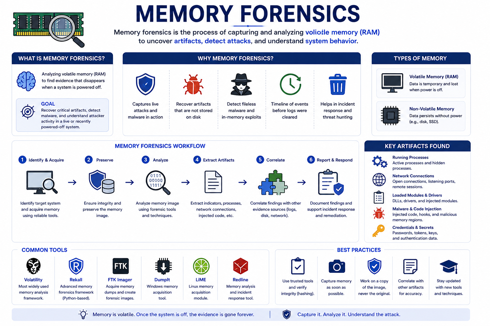

# Day 62 - Memory Forensics

## What It Is
Memory Forensics is the practice of capturing and analyzing the contents of a computer's RAM (Random Access Memory) to investigate security incidents, detect malware, and recover evidence that exists only in memory and never touches the disk. Many modern attack techniques — including fileless malware, injected code, and in-memory credential theft (Mimikatz, day 17) — deliberately avoid writing to disk to evade traditional antivirus and forensic tools. Memory forensics is often the only way to catch these attacks, recover encryption keys, find running malicious processes, and reconstruct what an attacker did on a system.

## How It Works
RAM is volatile — it loses its contents when the system is powered off. Memory forensics must be performed on a live system or from a memory dump captured before shutdown. A memory dump is a complete snapshot of everything in RAM at a specific moment — running processes, network connections, loaded DLLs, decrypted data, passwords, and more.



```
What memory forensics reveals:

Running Processes
All processes active at capture time including hidden ones
Rootkits (day 18) that hide from Task Manager are visible in raw memory
Process injection — malicious code injected into legitimate processes
(common technique: injecting into svchost.exe or explorer.exe)

Network Connections
All active and recently closed network connections
C2 connections from RATs (day 20) and Cobalt Strike beacons (day 27)
Connections that closed before the analyst started investigating

Loaded DLLs and Injected Code
Malicious DLLs loaded into legitimate processes
Reflective DLL injection — loading code without touching disk at all
Shellcode injected directly into process memory

Credentials and Encryption Keys
Plaintext passwords cached in memory by Windows LSASS process
(exactly what Mimikatz exploits — day 17)
Encryption keys for full-disk encryption — can decrypt drives
Browser saved passwords held in memory while browser is open
Session tokens and cookies from active sessions

Malware Artifacts
Unpacked malware — packed malware unpacks itself in memory to run
Config files embedded in malware — C2 addresses, encryption keys
Strings that reveal attacker infrastructure and tooling
```

Memory analysis workflow:
```bash
# Step 1 - Capture memory from a live Windows system
# Using WinPmem (free, open source)
winpmem_mini_x64_rc2.exe memory.dmp

# Using DumpIt (simple, single executable)
DumpIt.exe

# Step 2 - Analyze with Volatility 3 (industry standard)
pip install volatility3

# List all running processes
vol -f memory.dmp windows.pslist

# Show process tree (reveals injected/orphaned processes)
vol -f memory.dmp windows.pstree

# Find hidden processes (compares different process listings)
vol -f memory.dmp windows.psscan

# List all network connections at time of capture
vol -f memory.dmp windows.netstat

# Find injected code in processes
vol -f memory.dmp windows.malfind

# Dump credentials from LSASS (like Mimikatz but forensically)
vol -f memory.dmp windows.hashdump
vol -f memory.dmp windows.lsadump

# Find command history (what commands were run)
vol -f memory.dmp windows.cmdline
```

## Real-World Example
Memory forensics was critical in the investigation of the 2017 NotPetya attack. Incident responders analyzing compromised systems found that NotPetya operated almost entirely in memory — it used EternalBlue (the same exploit used by WannaCry) to spread, then injected its ransomware payload into legitimate processes. By analyzing memory dumps from affected systems, researchers were able to reconstruct the exact propagation mechanism, recover the malware's credential-stealing component (which was a modified Mimikatz), and understand the full attack chain without the malware ever writing its core components to disk in a recoverable way. Without memory forensics, the investigation would have been blind to most of what the malware actually did.

## Why It Matters
From an attacker's side, fileless malware and in-memory techniques are specifically designed to defeat disk-based forensics. If nothing is written to disk, traditional forensic imaging of the hard drive reveals nothing. Modern sophisticated malware increasingly lives entirely in memory — making memory forensics the primary detection mechanism for advanced attacks.

From a defender's side, memory forensics should be a standard part of any incident response (day 30) playbook for suspected compromises. Capturing memory immediately upon detecting suspicious activity preserves volatile evidence that will be lost the moment the system is rebooted. Endpoint detection and response (EDR) tools perform continuous behavioral memory monitoring to catch in-memory attacks in real time rather than requiring post-incident forensic analysis.

## Key Terms
- Memory Forensics: the analysis of RAM contents to investigate security incidents and detect malware that avoids writing to disk
- Memory Dump: a complete snapshot of a system's RAM contents at a specific point in time, used as the primary artifact for memory analysis
- Fileless Malware: malware that operates entirely in memory without writing executable files to disk, evading traditional antivirus detection
- Process Injection: a technique where malicious code is inserted into the memory space of a legitimate running process to hide and execute
- Volatility: the industry-standard open source memory forensics framework used to analyze memory dumps from Windows, Linux, and macOS

## One Tip / Tool

Tool: `Volatility 3` — the industry standard open source memory forensics framework

```bash
# install Volatility 3
git clone https://github.com/volatilityfoundation/volatility3
cd volatility3
pip install -r requirements.txt

# most useful plugins for incident response:

# process analysis
vol -f memory.dmp windows.pslist      # list processes
vol -f memory.dmp windows.pstree      # process tree
vol -f memory.dmp windows.psscan      # find hidden processes
vol -f memory.dmp windows.dlllist     # DLLs loaded per process

# network analysis
vol -f memory.dmp windows.netstat     # network connections

# malware detection
vol -f memory.dmp windows.malfind     # find injected code
vol -f memory.dmp windows.dumpfiles   # extract files from memory

# credential extraction
vol -f memory.dmp windows.hashdump    # extract password hashes

# artifact recovery
vol -f memory.dmp windows.cmdline     # command line arguments
vol -f memory.dmp windows.filescan    # find files referenced in memory
```

Practice memory forensics on **MemLabs** — a free collection of memory forensics CTF challenges with realistic memory dumps covering malware analysis, credential extraction, and hidden process detection. Each challenge provides a memory dump and a series of questions that guide you through the analysis process using Volatility.
