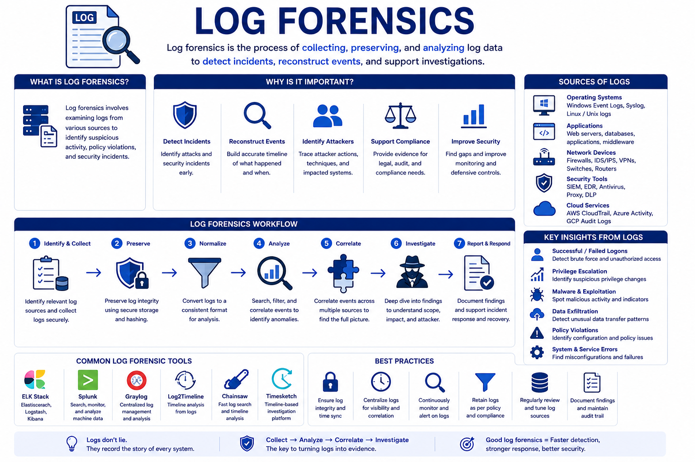

# Day 64 - Log Forensics

## What It Is
Log Forensics is the practice of collecting, preserving, and analyzing log data from systems, applications, and network devices to reconstruct security incidents, detect attacker activity, and establish a timeline of events. Logs are the most widely available source of forensic evidence in any environment — every operating system, web server, firewall, authentication system, and cloud service generates them continuously. While memory forensics (day 62) captures volatile evidence and disk forensics (day 63) examines persistent storage, log forensics focuses specifically on the recorded audit trail that systems generate about their own activity.

## How It Works
Logs record events in structured or semi-structured formats with timestamps, event types, and contextual details. The challenge isn't collecting logs — it's knowing which logs matter, where to find them, and how to correlate events across multiple sources to reconstruct an attack.


```
Critical log sources for forensic investigation:

Windows Event Logs
Location: C:\Windows\System32\winevt\Logs\
Key log files:
- Security.evtx   : authentication, privilege use, account changes
- System.evtx     : system events, service installs, driver loads
- Application.evtx: application crashes, errors, warnings

Critical Windows Event IDs:
4624  Successful logon (note logon type: 3=network, 10=remote interactive)
4625  Failed logon (repeated = brute force attempt)
4648  Logon with explicit credentials (Pass the Hash indicator, day 17)
4672  Special privileges assigned (admin logon)
4688  Process creation (what programs ran and who ran them)
4698  Scheduled task created (persistence mechanism, day 18-20)
4720  User account created (attacker creating backdoor accounts)
4776  Credential validation (NTLM authentication attempts)
7045  New service installed (common persistence and rootkit indicator)

Linux Logs
/var/log/auth.log     : SSH logins, sudo usage, authentication
/var/log/syslog       : general system events
/var/log/apache2/     : web server access and error logs
/var/log/secure       : authentication on RHEL/CentOS systems
~/.bash_history       : command history (often cleared by attackers)
/var/log/cron         : scheduled task execution

Web Server Logs (Apache/Nginx)
Format: IP - - [timestamp] "METHOD /path HTTP/version" status size
Reveals: SQL injection attempts (day 04), directory traversal, scanner activity
Look for: 404 storms (scanning), unusual user agents, POST to unexpected paths

Firewall and Network Device Logs
Inbound connection attempts, blocked traffic
Outbound connections to unusual destinations (C2 callbacks, day 09, 20, 27)
Large data transfers (exfiltration)
Connections to known malicious IPs (cross-reference with IOCs, day 60)

Cloud Logs
AWS CloudTrail  : all API calls made in AWS account
AWS VPC Flow Logs: network traffic metadata for VPC resources
Azure Activity Log: management operations in Azure
GCP Cloud Audit Logs: admin activity and data access
```
Log analysis techniques:
```bash
# Windows - query event logs with PowerShell
# Find all failed logons in last 24 hours
Get-WinEvent -FilterHashtable @{LogName='Security'; Id=4625; StartTime=(Get-Date).AddDays(-1)}

# Find all process creation events
Get-WinEvent -FilterHashtable @{LogName='Security'; Id=4688} |
  Select-Object TimeCreated, @{N='Process';E={$_.Properties[5].Value}}

# Linux - analyze auth logs for SSH brute force
grep "Failed password" /var/log/auth.log | awk '{print $11}' | sort | uniq -c | sort -rn

# Find successful SSH logins after failures (successful brute force)
grep "Accepted password" /var/log/auth.log

# Web log analysis - find SQL injection attempts
grep -E "('|--|union|select|insert|drop|exec)" /var/log/apache2/access.log

# Find requests returning unusual status codes
awk '{print $9}' /var/log/apache2/access.log | sort | uniq -c | sort -rn

# AWS CloudTrail - find all API calls from a suspicious IP
aws cloudtrail lookup-events --lookup-attributes \
  AttributeKey=ClientToken,AttributeValue=SUSPICIOUS_IP
```
## Real-World Example
In the investigation of the 2020 SolarWinds breach (referenced throughout this repo), log forensics was central to understanding the full scope of the attack. FireEye (now Mandiant) investigators analyzed Windows Event Logs across thousands of systems looking for the specific Event ID 4688 (process creation) patterns associated with the SUNBURST backdoor's lateral movement. CloudTrail logs in AWS environments revealed which S3 buckets were accessed using the stolen credentials. Authentication logs showed the specific accounts used for lateral movement and the exact timeline of when each system was compromised. Without comprehensive log collection and retention, the investigation would have been impossible — many organizations discovered they lacked logs going back far enough to capture the initial compromise, which had occurred months before detection.

## Why It Matters
From an attacker's side, log tampering and log deletion are standard attacker tradecraft — clearing Windows Event Logs (Event ID 1102 records this), deleting bash history, and disabling logging are often among the first actions after gaining access. Attackers who understand log forensics specifically target the evidence trail.

From a defender's side, centralized log collection to a SIEM (day 28) that the attacker cannot access is the critical defense against log tampering — if logs are shipped to a remote system in real time, deleting them locally doesn't destroy the evidence. Enabling verbose audit logging (especially process creation with command line logging, Event ID 4688) dramatically increases forensic value. Log retention policies of at least 90 days (ideally 12 months) ensure logs exist far enough back to investigate slow-moving APT campaigns.

## Key Terms
- Log Forensics: collecting and analyzing log data from systems and applications to reconstruct security incidents and attacker activity
- Event ID: a numeric code in Windows Event Logs identifying the type of event recorded — essential for filtering relevant security events
- Log Tampering: an attacker deleting or modifying log entries to destroy evidence of their activity — detected by monitoring for Event ID 1102
- Centralized Logging: shipping logs to a remote system in real time, preventing local log deletion from destroying evidence
- Log Retention: the policy defining how long logs are kept — insufficient retention leaves organizations blind to slow-moving APT campaigns

## One Tip / Tool

Tool: `Eric Zimmerman's Tools` (Windows log analysis) and `GoAccess` (web log analysis)

```bash
# Eric Zimmerman's EvtxECmd - parse Windows Event Logs to CSV
EvtxECmd.exe -f Security.evtx --csv C:\output\ --csvf security_events.csv

# then analyze with Timeline Explorer (also by Eric Zimmerman)
# filter by Event ID, sort by timestamp, search for specific users or processes

# GoAccess - real time web log analyzer
apt install goaccess
goaccess /var/log/apache2/access.log -c  # interactive terminal dashboard
goaccess /var/log/apache2/access.log -o report.html --log-format=COMBINED

# Chainsaw - fast Windows Event Log hunting tool
# specifically designed for threat hunting and incident response
git clone https://github.com/WithSecureLabs/chainsaw
./chainsaw hunt /path/to/evtx/logs/ -s sigma/ --mapping mappings/sigma-event-logs-all.yml

# Sigma rules - standardized log detection rules (like Snort but for logs)
# thousands of community rules for detecting known attack patterns
# https://github.com/SigmaHQ/sigma
```

The single most impactful logging improvement most organizations can make — enable **command line logging in Windows process creation events** (Event ID 4688). By default, Windows logs that a process ran but not what command line arguments were used. Enabling command line logging shows exactly what commands attackers ran, turning a partial audit trail into a complete one. This is configured through Group Policy: Computer Configuration → Administrative Templates → System → Audit Process Creation → Include command line in process creation events.
